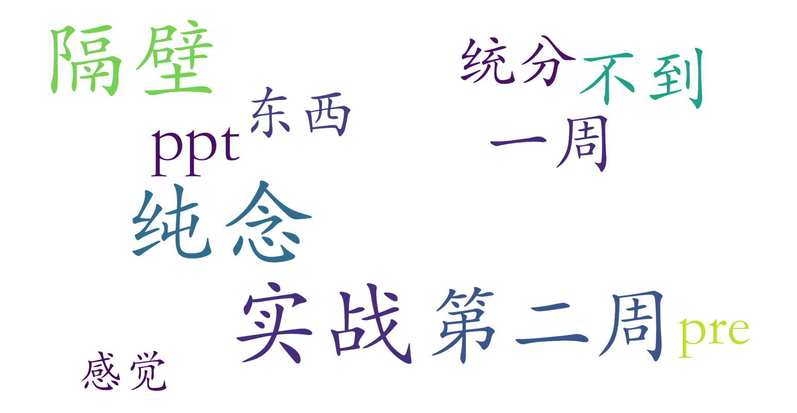

### 大模型：从基础到前沿（信息科学技术学院，2学分）

#### 课程难度与任务量  
课程为1-2周短期密集授课模式，每日连续上课可能导致学习强度较高。核心任务集中在第二周的小组或个人展示（pre），需在一周内完成选题与汇报准备，时间压力较大。无考试要求，但短期内需消化大量基础理论知识。适合有一定机器学习背景的学生，但测评未提及明确先修门槛，推测入门难度可控。

#### 课程听感与收获  
授课方式以PPT讲解为主，缺乏互动与实践环节，学生反馈“学不到东西”并建议选择偏实战的同类课程。课程内容可能侧重基础概念与前沿理论综述，但因缺乏案例分析与技术实操，对希望深入应用的学生帮助有限。PPT质量或讲解深度可能未能满足部分学生期望，需结合自学补充。

#### 给分好坏  
据学生社群（统分洞）讨论反馈，给分表现平平，可能存在正态调整限制高分比例。成绩构成或主要依赖pre表现与课堂参与，但具体评分细则未公开。未提及调分政策，推测最终成绩较严格遵循既定标准，获得高分的竞争较为激烈。

#### 总结与建议  
该课程适合对大模型理论框架感兴趣且时间紧凑的学生，尤其适合希望短期了解领域概貌的信科相关专业同学。若追求实践能力提升或高分，建议优先选择含实验环节的课程。选课后需主动扩展学习资源弥补授课深度不足，并尽早规划pre内容以应对集中任务压力。总体而言，作为2学分的任选课，其短期高强度模式利弊并存，需根据个人学习目标权衡选择。
