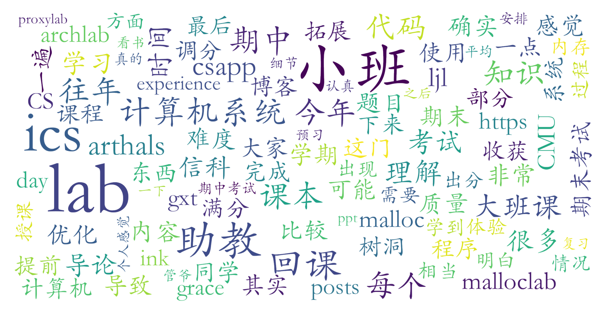

### 计算机系统导论/ICS（信息科学技术学院，5学分）

#### 课程难度与任务量  
作为信科最经典也最知名的核心硬核课程，任务量极大，难度也很高，涉及8个CMU经典Lab（如archlab、malloclab等），单个Lab耗时普遍在10-30小时，部分需通宵完成。课程覆盖计算机系统全栈知识（汇编、处理器架构、内存管理、网络编程等），需精读700+页的《深入理解计算机系统》（CSAPP）。期中期末考试难度较高，题型偏细节，需大量刷往年题（15年至今）以应对“八股文”式考察。学生普遍反映每周课后投入10小时以上，学期总学习时长堪比8学分课程。

#### 课程听感与收获  
- **大班课**：教师风格差异显著。陈向群/刘先华班被指声音低沉易催眠，管雪涛班节奏高屋建瓴但需课前预习，陆俊林班以生动比喻（如“图书馆搬书”）和清晰逻辑广受好评。多数学生选择自学CSAPP替代听课，因为普遍认为大班讲课不能有效应对考试。
- **小班课**：课程亮点之一，形式为“回课”（学生讲解知识点+助教拓展）。助教水平参差不齐，优秀助教会补充考试技巧、自费请奶茶，甚至赠送CPU纪念品；部分小班则因平均分限制（80%）引发争议。
- **Lab与教材**：Lab设计精良但“魔改”后难度高于CMU原版，需参考开源资料（如Arthals博客）辅助。CSAPP被誉为“神书”，自学收益远超听课，尤其流水线、虚拟内存等章节备受推崇。

#### 给分好坏  
- **评分构成**：Lab 30%+小班分15-20%+期中15%+期末35-40%。小班分存在“均值限制”，非图灵班可能被压分。  
- **调分与正态**：一般不调分，但难度过大的年份（18、24年）会调分。期末后调分传闻普遍（约1-2分），但小班均分限制导致总评扣分。优秀率控制严格，部分学生抱怨“努力喂狗”，但也有竞赛生/双学位选手通过卷Lab和考试获得90+。  

#### 总结与建议  
**适合群体**：对系统领域有强烈兴趣、能承受高压任务量的CS必修学生；非必修需谨慎权衡时间成本与知识收益。  
**学习策略**：  
1. **超前自学**：提前1-2周精读CSAPP，重点关注汇编、虚拟内存等章节；  
2. **Lab优先**：尽早启动Lab（尤其后半学期的tshlab、malloclab），善用Grace Day，避免DDL灾难；
3. **应试技巧**：刷透近8年期中期末题，死磕课本细节（每句话都可能成考点）；  
4. **小班协作**：积极参与回课准备，主动向助教提问以提升小班分。  
**争议点**：考试与教学内容脱节（教考分离）、Lab查重压力、出分速度慢（开学前一天出分，总是暂时不能给你明确的答复）。虽然总体仍被视为信科教学质量标杆，但改革呼声强烈。
