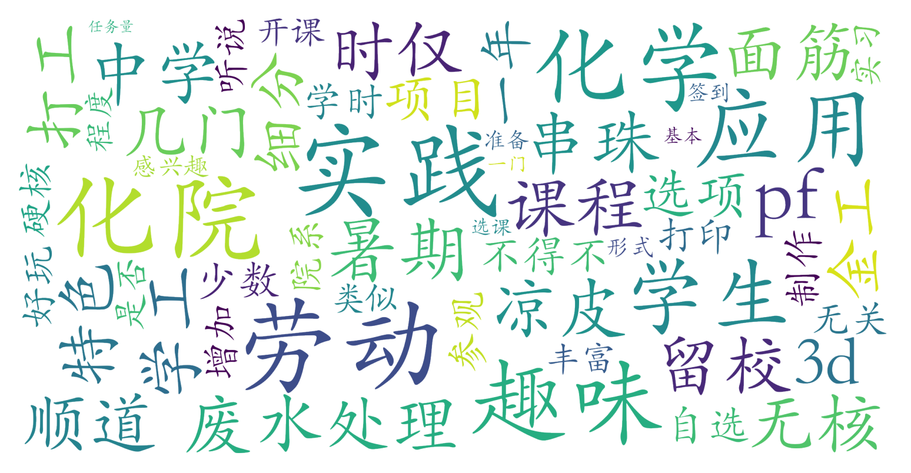

### 化学应用与实践（化学与分子工程学院，1学分）

#### 课程难度与任务量  
课程为暑期集中授课的劳动实践课，任务量极轻且无硬核内容。学生通过自选金工实习、3D打印、废水处理参观、手工制作（如串珠、凉皮面筋制作）等趣味项目完成课程，全程无课后作业或考试压力。课程时间集中在6月下旬连续4天（每日3-10节），属于短期高强度集中实践模式。

#### 课程听感与收获  
课程定位为劳动教育实践，内容与化学专业关联度较低，更侧重动手操作与社会体验。授课形式类似中学学工活动，通过车间操作、参观调研等提升劳动技能。PPT与理论教学占比较少，实践过程本身即为主要学习内容。对外院系学生而言，可作为零门槛获取32劳动学时的趣味项目；对化院学生则是暑期留校期间的"顺带"课程。

#### 给分好坏  
采用PF制（通过/不通过），不参与GPA计算。完成课程即可获得合格评定，无成绩竞争压力。课程要求签到但未提及考勤严格性，整体属于"白赚学时"的低风险课程。

#### 总结与建议  
推荐给两类学生：① 化院学生作为暑期留校期间的"劳育凑学分"选择；② 任何院系需快速获取劳动学时的学生。课程趣味性高于学术性，不适合追求专业知识提升者。选课时建议优先选择制作类项目（如凉皮面筋、3D打印）以增强体验感。需注意PF制可能影响部分奖学金评定，选课前建议确认院系成绩记载政策。
