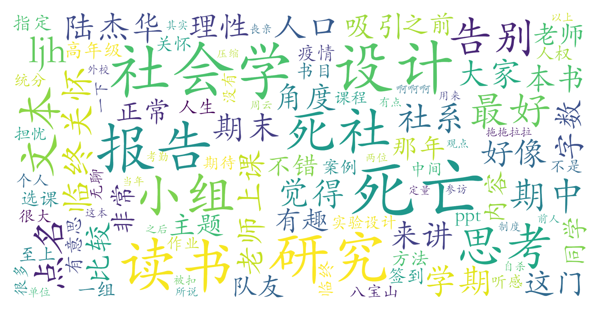

### 死亡的社会学思考（教务部，2学分）

#### 课程难度与任务量  
课程任务量集中在期中读书报告（指定书目《最好的告别》，字数要求5000-7000字）和期末小组研究设计（选题需与死亡相关，字数1万+）。暑校因时间压缩导致任务强度陡增（读书报告需一周完成，小组作业仅半月准备），但正常学期节奏相对合理。课程无考试，但研究设计需掌握基本社会学方法，非社科背景学生可能需额外学习或依赖队友。部分学生提到“全勤可保正态”，但缺勤可能影响总评上限。

#### 课程听感与收获  
课程内容涵盖死亡制度、临终关怀、丧亲关怀等多元视角，穿插人口学理论与社会学研究方法。陆杰华教授授课风格平和，PPT内容详实但部分年份课件较陈旧，部分学生反映“念PPT”导致课堂略显枯燥。亮点在于邀请临终关怀从业者、医学专家等嘉宾讲座（如北医老师分享案例），以及疫情前组织的殡仪馆/八宝山参访活动（近年常因故取消）。课程推荐书目（如《温暖消逝》《此生未完成》）对生命观塑造有启发，但深度分析相对有限，更适合作为社会学入门体验课。

#### 给分好坏  
成绩构成通常为：考勤20-30%+读书报告30%+研究设计40-50%。优秀率控制严格，全勤且作业达标者普遍85+，但90+比例有限（暑校优秀率可能放宽）。部分学期通过提高考勤权重调控优秀率，缺勤者可能被正态至84分。研究设计若选题新颖、格式规范且团队配合良好，有机会冲击90+。教师对非社科背景学生要求较宽松，但建议主动沟通选题以获得指导。

#### 总结与建议  
**适合人群**：① 需完成通识核心学分且对死亡议题感兴趣者；② 希望初步接触社会学研究方法者；③ 能接受小组合作风险（建议跨年级组队，优先吸纳社科背景成员）。  
**避雷提示**：追求高绩点者需谨慎评估团队合作风险；期待深度哲学思辨或实践体验者可能失望。  
**学习建议**：① 重点参与研究设计方法讲解课；② 提前阅读《最好的告别》并记录跨学科思考；③ 主动预约教师指导选题。总体而言，作为通识课在知识广度与任务强度间平衡较好，但不宜期待过高学术深度。
