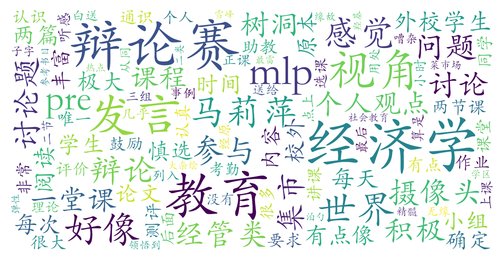

### 经济学视角下的教育世界（教务部，2学分）

#### 课程难度与任务量  
课程无需特定先修知识，内容偏向教育领域的社会热点讨论（如学区房、教育公平等），经济学理论与方法涉及较浅。任务量中等偏上但存在弹性：包含课前阅读作业（500-800字/次）、课堂发言、小组pre、辩论赛及5000字期末论文。每周需投入约6-10小时（暑校课程压缩在两周完成），其中辩论赛和pre需线下合作，期末论文有1个月准备期。无考试，但需注意课程时间集中（连续多日每天4小时课程），校外学生参与可能影响课堂节奏。

#### 课程听感与收获  
授课以“热点讨论+案例分析”为主，教师讲解清晰且鼓励互动，但理论深度有限。课堂氛围两极分化：校外学生占比较高导致部分时段嘈杂，而小组讨论和辩论环节能促进跨背景交流。PPT与阅读材料质量较高，但核心内容更接近通识性社会议题探讨，经济学视角的学术性较弱。理科生和跨领域学生普遍反馈视野拓展效果显著，而经管背景学生可能认为内容与专业课程重叠。

#### 给分好坏  
总评构成复杂但容错性强：签到（5%）、课堂发言（10%）、课前作业（35%）、辩论赛（10%）、期末论文（40%）。给分整体宽松，积极参与者易获90+，辩论赛获胜组有额外优势。多份测评显示优秀率较高（包括95+案例），但存在助教评分标准不透明的个别负面反馈。未提及强制正态，暑校可能存在优秀率政策倾斜。

#### 总结与建议  
**适合人群**：对教育社会问题感兴趣的非经管学生，能接受高强度互动课堂者。经管类专业学生慎选（内容与专业课重复率高）。  
**学习策略**：提前规划作业时间（尤其是压缩课程周期），主动参与小组讨论和辩论环节（直接影响10%发言分与辩论分），期末论文需结合课程案例深化分析。  
**总体评价**：作为通识课，其讨论式教学能有效激发跨学科思考，但课程设计偏向“热点研讨会”，经济学方法论训练不足。推荐给希望轻松获得通识学分且擅长表达的学生，学术向学习者需降低预期。
