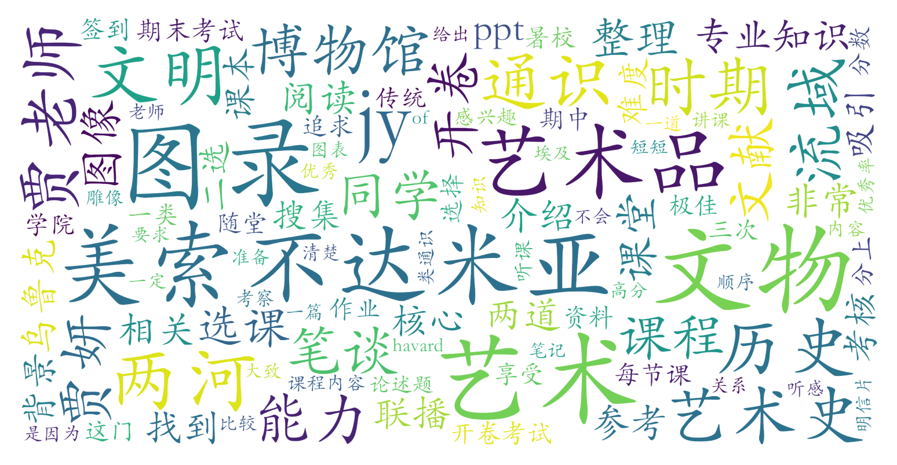

### 美索不达米亚艺术与文明（教务部，2学分）

#### 课程难度与任务量  
课程无需先修知识，但需具备一定的英文文献阅读与资料检索能力。作为暑期密集课程，两周内需完成10次高强度授课（每天4小时），任务量集中在三次文物图录作业（每篇1000-3000字，需查阅大量文献）和开卷期末策展词写作。考试不侧重记忆，但要求对课程内容的理解与应用，部分考题涉及细节对比或开放性设计。总体难度中等偏高，文献整理可能对新手具有挑战性，但可通过参考通识联播优秀作业降低门槛。

#### 课程听感与收获  
贾妍老师（哈佛艺术史博士）授课水平广受赞誉：内容层次清晰，结合历史脉络与艺术品深度解读，穿插埃及艺术对比拓展视野；语言表达精准生动，PPT制作精良，课堂节奏张弛有度。课程聚焦两河流域艺术史，涵盖苏美尔、巴比伦等文明的核心艺术品分析，辅以神话史与图文关系专题，兼具学术性与趣味性。暑校长时间授课易疲劳，但预习教材（英文为主）或课后复习可有效弥补注意力分散问题。

#### 给分好坏  
成绩构成为签到（10-20%）+三次图录作业（60%）+期末开卷考试（20-30%）。教师明确遵循40%优秀率限制（85分以上），但会尽量给予优秀率边缘学生84/84.5分。90+高分比例较低（约4-5%），但态度认真、文献检索能力强的学生较易获得85+。作业评分区分度较高，期末策展词注重创意与课程内容整合能力，突击复习效果有限。

#### 总结与建议  
**推荐人群**：对古文明、艺术史或跨文化研究感兴趣的学生，无需专业背景。尤其适合希望通过通识课获得硬核知识提升者。  
**学习建议**：  
1. **课堂参与**：老师强调“观察”方法，自学教材难以替代现场听讲；  
2. **文献检索**：善用博物馆官网、维基百科、JSTOR等资源，结合翻译工具处理英文文献；  
3. **作业策略**：参考通识联播往期优秀作业框架，注重文物背景与艺术流变分析；  
4. **期末准备**：整理课堂笔记与重点文物对比案例，强化策展思维训练。  
该课程以高密度的知识输出与独特的艺术史视角著称，虽任务量集中于短期，但对开阔人文视野具有显著价值，是通识核心课中兼具学术深度与体验感的优质选择。
