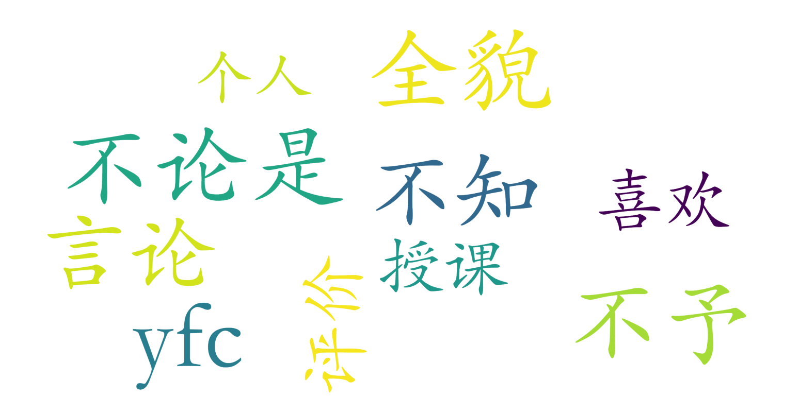

### 人工智能生成内容实务（AIGC）（新闻与传播学院，2学分）

#### 课程难度与任务量  
课程为1-2周集中授课的短期任选课，从课程名称"实务"及集中授课安排推测，可能以实践操作为主。由于课时压缩在两周内完成，每日连续上课（周一至周五每天2-4节），学生需在短时间内高强度投入。暂无作业量、考试形式等具体信息，但基于实务类课程特性，可能存在小组项目或工具实操任务。

#### 课程听感与收获  
测评仅提及对授课教师存在争议性评价，显示学生对教师的教学风格或内容呈现方式存在不适应。结合课程名称推测，教学内容应聚焦AIGC技术应用与案例分析，可能涉及AI写作、图像生成等前沿领域实践。但由于缺乏详细反馈，无法判断课件质量、知识深度与课堂互动效果。

#### 给分好坏  
存在明确负面评价"不论是给分"，暗示给分可能存在争议。考虑到北大课程的正态分布政策，不排除存在强制压分情况。由于课程为任选课，建议关注课程备注中是否标明PF制，但当前信息显示仍采用常规评分体系。

#### 总结与建议  
该课程适合对AIGC技术有强烈实践兴趣、能适应高强度短期集训的学生。由于存在授课风格争议与给分不确定性，建议非必修学生提前试听，并与往届选课者沟通具体体验。选课后需做好时间管理以应对可能的密集任务，同时建议主动与教师沟通评分标准。需注意课程仅开课2周的特殊性，需与其他长周期课程做好时间协调。

提示：以上内容基于课程基本信息由LLM推测得到，并非来自学生测评，请谨慎参考！
