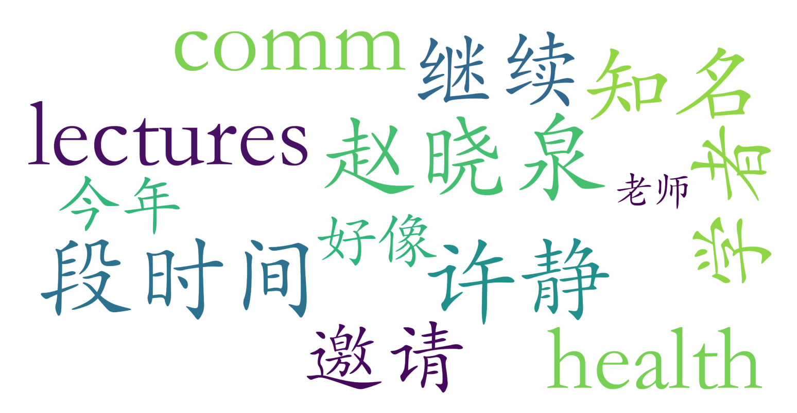

### 健康传播研究：理论与方法（新闻与传播学院·1学分）

#### 课程难度与任务量  
作为1学分的任选课，课程强度相对较轻。从排课信息看，该课程采用2周内集中授课模式（连续5天每天3节课），属于短期高强度学习类型。由于学生测评未提及具体作业或考试要求，推测可能以课堂参与、小组讨论或小型研究报告为主要任务形式。课程涉及健康传播领域的理论与方法，可能需要基础传播学知识储备，但跨专业选课门槛应不高。

#### 课程听感与收获  
课程亮点在于邀请赵晓泉等国内外健康传播领域知名学者进行专题讲座，形成多导师联合授课模式。这种设计既能保证学术前沿性，又可提供多元视角。许静教授作为课程负责人，其学术背景与人格魅力（学生评价"人很好"）有助于营造良好学习氛围。但由于课程时间紧凑，可能存在知识密度过高的情况，需要学生提前做好文献预习准备。

#### 给分好坏  
现有测评未明确提及评分细则，但作为短期专题研讨型课程，推测成绩构成可能以出勤（30%）、课堂表现（40%）和结课报告（30%）为主。考虑到课程性质偏重参与而非考核，给分应较为宽松。需要注意的是1学分课程通常不设置复杂评分体系，但优秀率限制仍可能存在。

#### 总结与建议  
适合对健康传播领域有探索兴趣、希望短期接触学术前沿的研究生或高年级本科生。对于非新传专业学生，可作为拓展学科视野的窗口课程，但需要主动补充传播学基础知识。建议选课者：①提前了解健康传播领域基础文献；②利用多导师授课优势，针对性准备问题与学者互动；③注意课程时间集中特点，合理安排其他学业任务。  

提示：以上内容基于课程基本信息由LLM推测得到，并非来自学生测评，请谨慎参考！
