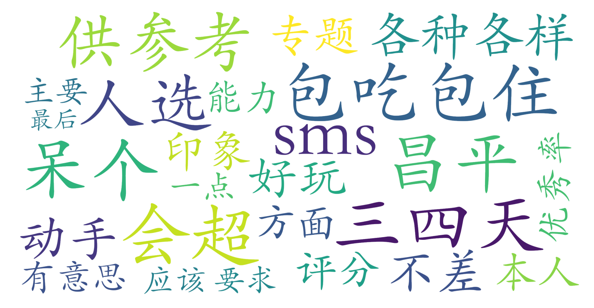

### 工程实训（材料科学与工程学院，3学分）

#### 课程难度与任务量  
课程实践性强，任务量集中在6月30日至7月8日的集中授课期，需前往昌平新燕园校区参与专题实训。学生反馈动手操作要求适中，更注重趣味性体验（如“好玩”“包吃包住”），未提及高强度作业或考试压力，整体难度偏低。课程形式以短期集中实践为主，适合暑期前时间灵活的学生。

#### 课程听感与收获  
课程由多位工程师与教授联合授课，专题设计多样化，涵盖不同工程领域的基础实践内容。测评提到“对动手能力有一点要求但不多”，显示课程内容偏向入门级实操体验，适合无专业背景的学生开拓视野。由于采用短期集中授课模式，课程节奏紧凑，但实践场景和团队协作可能带来新鲜感与跨学科启发。

#### 给分好坏  
测评者（数院学生）最终获得93分，推测课程优秀率可能突破常规限制（如“优秀率会超”），给分较为宽松。成绩构成或与专题参与度、实践成果直接相关，无考试压力。因课程属劳动教育类选修课，评分标准可能更侧重态度而非专业能力。

#### 总结与建议  
该课程适合以下学生：  
1. **期望短期实践体验**：需投入约一周时间，适合想避开传统课堂、通过动手实践获取学分者；  
2. **跨学科兴趣探索**：非材料专业学生（如数院）可通过多样化专题了解工程领域基础；  
3. **追求高性价比选修课**：任务量低、给分友好，且包吃住减轻后勤负担。  
**注意**：课程需赴昌平校区，需提前规划交通时间；选课名额紧张（限15人），建议优先选课。总体而言，作为劳动教育课兼具趣味性与实用性，推荐作为暑期前调剂学习的轻量选择。
