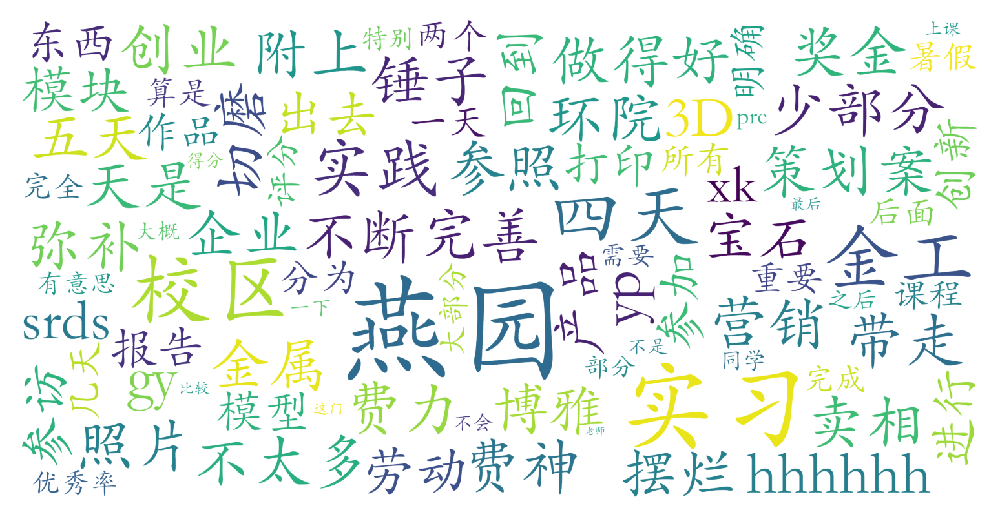

### 课程名称：金工实习（材料科学与工程学院，3学分）

#### 课程难度与任务量  
课程为暑期集中实践课，分为两个阶段：前5天在新燕园校区进行动手实践（如3D打印、宝石切磨、金属模型制作），后4天在燕园校区参与创新创业策划与展示。任务量集中在实践操作环节，例如制作小锤子需投入较多体力和时间，但作品可带走且趣味性强；后期策划案与营销pre存在一定自由度，部分学生会选择简化完成。无考试压力，主要考核实习报告和作品质量。

#### 课程听感与收获  
实践阶段内容新颖实用，通过企业参访、工坊操作等增强工程认知，学生普遍反馈“收获实体成果”的体验感突出。创新创业课程部分以小组合作形式展开，虽部分学生认为“摆烂也能过”，但优秀策划案可获得奖金激励。教师团队以现场指导为主，注重动手能力培养，但理论授课内容相对较少。

#### 给分好坏  
评分完全基于前5天实习模块，需提交含作品照片的实习报告。测评者卷报告后获95分，且明确提到“不卡优秀率”（即不强制正态分布），推测给分较为宽松。无签到要求，总评构成简单透明，适合追求高绩点的学生。

#### 总结与建议  
推荐给**偏好实践操作、希望获得劳动教育学分**的学生（尤其是工学院、环院、信科等工科生）。课程优势在于沉浸式工坊体验与自由创作空间，暑期集中授课的形式也便于时间安排。建议：  
1. 前5天实践环节需认真对待，作品质量直接影响报告素材；  
2. 后期策划案可结合实习内容展开，适当投入精力可能提升评奖机会；  
3. 无需过度焦虑理论考核，重点展示实践成果与反思即可。  
总体而言，这是一门兼顾趣味性与实用性的劳动教育课，给分友好度较高。
