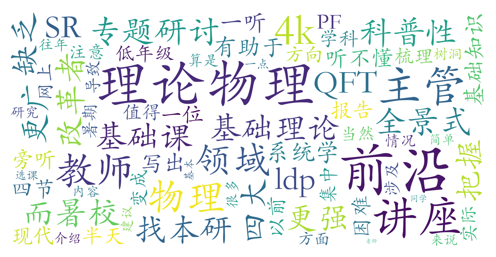

### 物理学科暑期专题研讨（物理学院，2学分）

#### 课程难度与任务量  
课程内容聚焦理论物理前沿领域（尤其是凝聚态物理方向），涉及相对论、量子场论等进阶知识，并包含四节基础理论梳理课。任务量集中在 **4k字研究报告** 上，对未系统学习过“四大力学”的低年级学生而言，因基础知识不足可能导致撰写困难。课程安排高度密集（两周内每天多节连上），需短期内高强度投入时间理解前沿内容。

#### 课程听感与收获  
课程采用 **多教师联合讲座模式**，每半天由不同教师介绍细分领域前沿进展，内容硬核且专业性强。基础课部分有助于构建理论框架，但对零基础学生仍有一定门槛。整体能帮助学生对理论物理研究形成全景式认知，尤其适合探索本研方向或深化领域兴趣。实际授课教师与选课网标注不一致，需注意课程改革带来的内容调整。

#### 给分好坏  
课程采用 **PF制（通过/不通过）**，不参与GPA计算，适合以拓展视野为目的的学生。测评未明确提及总评构成，但最终成绩仅依赖研究报告，可能存在“完成即通过”的宽松标准。无签到要求，但需注意课程主管教师的调整可能影响评分尺度。

#### 总结与建议  
**适合人群**：  
- 高年级物理专业学生（尤其计划从事凝聚态物理研究者）  
- 已掌握四大力学基础、希望快速接触前沿方向者  
**避雷提示**：  
- 低年级学生若缺乏前置知识，建议旁听而非选课  
- 短期高强度授课可能带来认知负荷，需提前预习相关文献  
**学习建议**：  
1. 结合基础课内容整理知识框架  
2. 主动与授课教师交流以明确报告方向  
3. 利用学院资源补充量子场论等背景知识  

该课程作为物理学院特色研讨课，在有限时间内提供了深度与广度兼备的前沿视野，但较高的认知门槛使其更偏向“进阶者友好型”课程。
