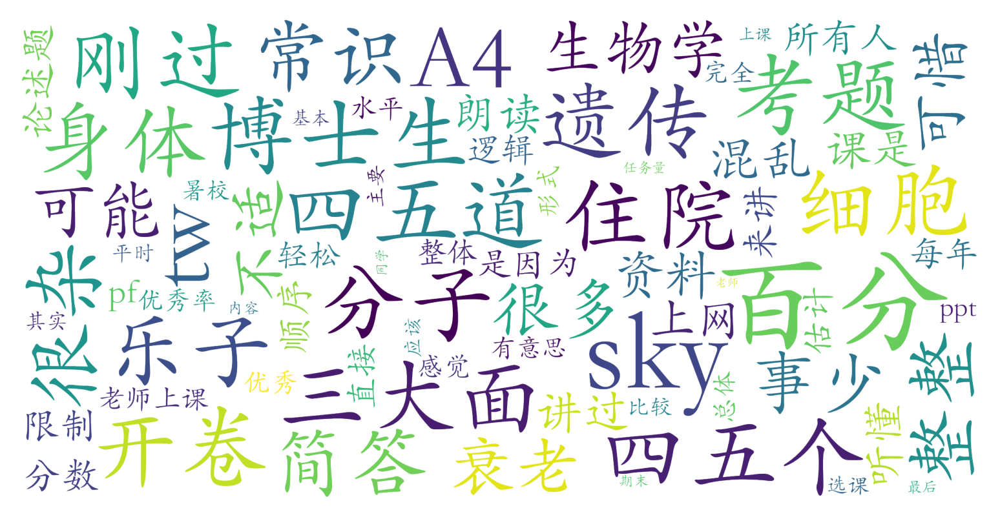

### 衰老生物学（生命科学学院，2学分）

#### 课程难度与任务量  
课程内容涉及分子遗传与细胞生物学基础，但授课深度适中，非生命科学学院学生也可理解。任务量极轻，无平时作业或论文要求，期末采用开卷考试形式（允许携带纸质资料）。考试内容与课堂关联性较弱，题型以简答论述为主，需要结合课外资料自行拓展作答。值得注意的是，课程在暑校期间集中1-2周完成，需适应密集授课节奏。

#### 课程听感与收获  
教师团队（含代课博士生）授课风格轻松有趣，穿插大量生物学研究案例与学界轶事。但课程内容广度优先于深度，各模块衔接逻辑性较弱，可能存在知识点跳跃现象。PPT内容较基础，建议通过自主补充文献提升系统性认知。对非专业学生而言，可作为生物衰老机制的入门科普课程。

#### 给分好坏  
总评采用百分制且存在优秀率限制（85分以上不超过40%），未提及具体成绩构成比例。开卷考试得分与作答详实程度相关，存在主观评分空间。测评者反馈成绩"刚过优秀线"，推测最终得分可能在85-89区间。虽然允许PF制选择，但实际统一采用百分制，需注意正态调整可能对分数产生压缩效应。

#### 总结与建议  
适合对衰老机制感兴趣或需要补充通识学分的学生选修，尤其推荐给希望减少课业压力的跨专业学习者。建议：①提前收集往届考题方向，针对性准备资料汇编；②在开卷资料中系统整理关键理论框架与研究范式；③关注不同讲者的授课重点，及时标注潜在考点。需注意暑校课程时间紧凑，日均4课时强度较高，建议提前预留学习时间。整体而言是一门知识性、趣味性与低负担兼顾的优质通选课。
