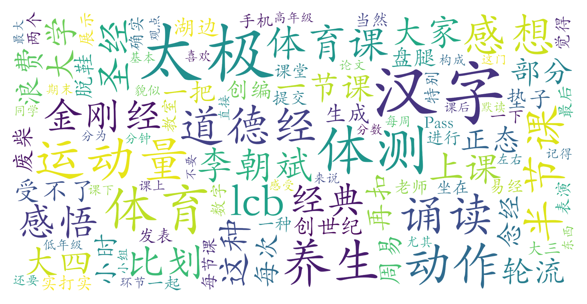

### 汉字太极与养生课（体育教研部，1学分）

#### 课程难度与任务量  
该课程被普遍认为是“体育课界的地震概论”，任务量极低。每周需提交约150字的课堂感悟（可通过AI辅助完成），期末需撰写3000字论文（选题固定）并参与小组动作创编展示（1-2小时即可完成）。课堂活动以诵读《周易》《道德经》等典籍和练习抽象化汉字太极动作为主，运动量接近零，甚至无需换运动服。体测扣分是总评主要影响因素，部分学生立定跳远等项目得零分仍能获得90+成绩。

#### 课程听感与收获  
课程呈现显著的两面性：  
- **争议性内容**：教师常将典籍与数字建模、生成等概念强行关联，被评价为“民科式解读”，部分理科生直言“需屏蔽老师发言”。课堂讨论环节常有观点碰撞，曾有学生因与教师辩论哲学问题而退课。  
- **独特体验**：教室环境清雅（一体南楼302），脱鞋盘坐的仪式感与湖边散步的地理优势，成为部分学生缓解学业压力的“摸鱼圣地”。有学生反馈通过组队机制拓展了社交圈，甚至发展出恋爱关系。

#### 给分好坏  
给分呈现明显年级差异：  
- 低年级（大一大二）普遍获得90+高分（仅扣体测分1-3分），被戏称“扣完体测分再扣1分就是最终得分”  
- 高年级（尤其大四）存在正态风险，可能出现84分档成绩   
- 体测占总评20%，其他考核项目实际扣分空间极小

#### 总结与建议  
**适合人群**：  
- 体育能力较弱（特别是球类/器械项目困难者）  
- 对绩点敏感的低年级学生  
- 能接受玄学理论熏陶的佛系学习者  

**避雷提示**：  
- 反感传统文化过度解读者慎选（课堂存在大量“创世孙悟空”式论述）  
- 大三大四学生若追求4.0需谨慎（正态概率上升）  
- 密闭空间脱鞋可能导致脚部不适（被戏称“脚臭课”）  

**学习策略**：  
1. 利用AI工具高效完成文字作业（多数学生反映教师不细看内容）  
2. 将课堂作为冥想放松时段，不必深究理论逻辑  
3. 优先选择低年级学期修读以规避正态  
4. 组队时可主动联络跨院系同学拓展社交圈  

该课程作为北大特色体育课，完美服务于“生存型选课”需求，但需以放弃知识获得感为代价。对于体育特困生而言，其性价比仍远超常规体育项目。
