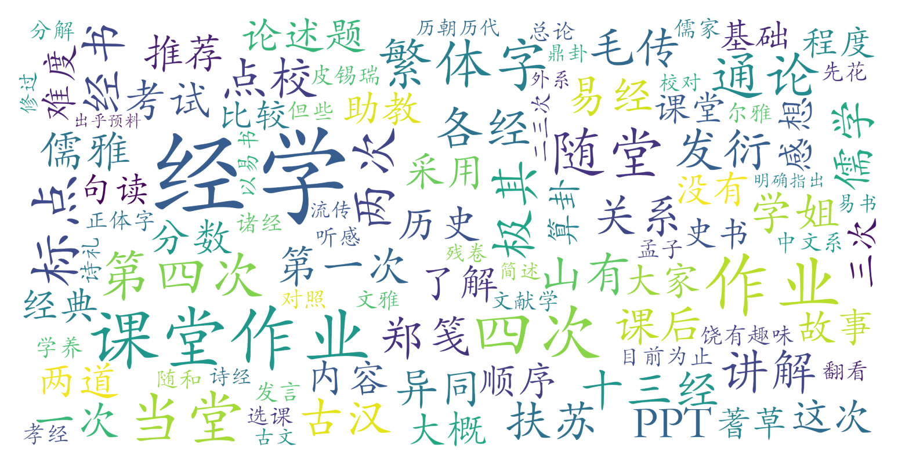

### 经学通论（中国语言文学系，2学分）

#### 课程难度与任务量  
课程无考试、无论文，任务量集中在四次作业（两次随堂、两次课后），内容涉及经学主题写作、古籍标点校勘及论述分析。标点作业需一定古文基础（如《易经》《毛诗》等），但无强制先修要求，非中文系学生通过预习繁体字与推荐书目亦可完成。随堂作业时间较紧张（如1小时限时论述），课后作业需投入较多时间查证文献。总体难度中等偏学术，但对零基础者友好。

#### 课程听感与收获  
顾永新老师授课儒雅细致，以十三经为主线，系统讲解经学发展史与经典注疏流变。课程内容深入浅出，PPT全用繁体字，外系学生需提前适应。课堂补充知识虽不直接关联考核，但能拓宽视野（如敦煌残卷分析）。助教耐心负责，提供作业指导。听课体验沉浸感强，尤其适合对经学、文献学或传统文化感兴趣的学生。

#### 给分好坏  
总评完全由四次作业构成，无考勤与课堂发言要求。多位外系学生反馈给分极佳（94.5-98分），作业完成度与学术规范性是得分关键。尽管标点作业难度较高，但教师对非专业学生的容错度较高，侧重考察学习态度而非绝对正确性。

#### 总结与建议  
**推荐群体**：对经学、古籍整理或中国传统文化有浓厚兴趣的学生；希望接触学术写作与文献分析的非中文系学习者。  
**学习建议**：  
1. 提前熟悉繁体字，阅读《经学历史》《经学通论》等推荐书目；  
2. 标点作业可结合电子古籍数据库（如中国哲学书电子化计划）辅助校勘；  
3. 随堂论述需逻辑清晰、引证合理，不必过度追求观点新颖。  
课程任务量适中，给分慷慨，适合作为人文类通识选修课。需注意连续四小时的课程节奏较慢，需保持专注力。
