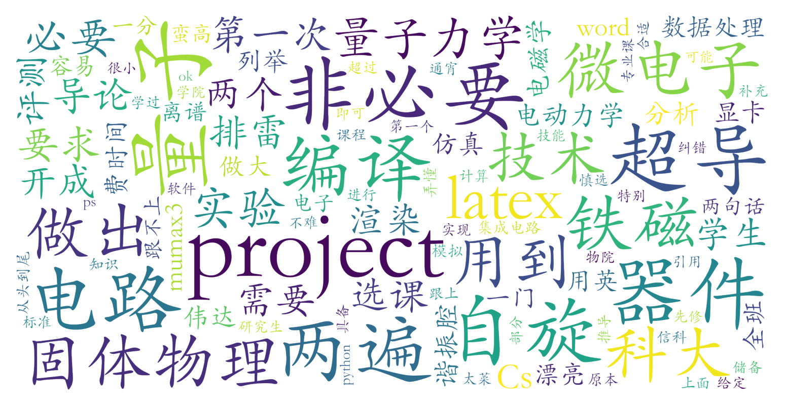

### 自旋与超导量子技术导论（信息科学技术学院，2学分）

#### 课程难度与任务量  
课程虽标注“无需先修”，但实际涉及**量子力学、固体物理**等核心知识储备，尤其需要理解铁磁材料、量子计算等专业内容。任务量远超一般公选课标准：需完成**两个仿真模拟项目（含数学推导、实验分析及视频讲解）**，且需掌握Python数据处理和LaTeX排版（编译细节可能影响评分）。学生反馈单项目通宵完成，建议避免同时选修其他课程。部分实验依赖英伟达显卡（如Mumax3），硬件门槛需注意。

#### 课程听感与收获  
教师团队（含港科大教师及业界人士）授课内容**前沿且逻辑清晰**，但因内容密度高、进度快，对基础薄弱学生存在理解门槛。课程聚焦自旋器件、量子电路等应用领域，结合仿真软件实践，对微电子、物理、电子相关专业学生有较强**科研衔接价值**。互动较少，可能因学生水平差异导致课堂参与度分化。

#### 给分好坏  
**给分优厚但竞争激烈**：认真完成项目可获95+高分（部分学生取得99分），评分主要依据项目质量与报告规范性。未提及正态调整，推测小班教学可能放宽优秀率限制。需注意LaTeX排版等技术细节（如未正确渲染可能扣分），但允许使用Word替代。

#### 总结与建议  
**适合群体**：  
1. 微电子、物理、电子、计算机等具备量子力学/固体物理基础的学生；  
2. 有意向量子计算或自旋器件领域深造者，课程内容可作科研入门跳板；  
3. 能接受高强度短期学习（暑期密集授课）并愿投入大量时间完善项目者。  

**慎选群体**：  
1. 无相关先修知识的跨专业学生，可能面临“听天书”困境；  
2. 仅希望轻松获取学分者，课程强度与“水课”定位完全不符。  

**学习建议**：  
- 提前自学量子力学基础（如波函数、自旋概念）与固体物理（铁磁材料章节）；  
- 预留充足时间调试仿真项目，避免硬件兼容问题；  
- 优先使用LaTeX撰写报告以减少格式扣分风险。  

该课程体现了“高投入高回报”特性，虽突破公选课常规难度，但对目标群体具有显著学术价值。
