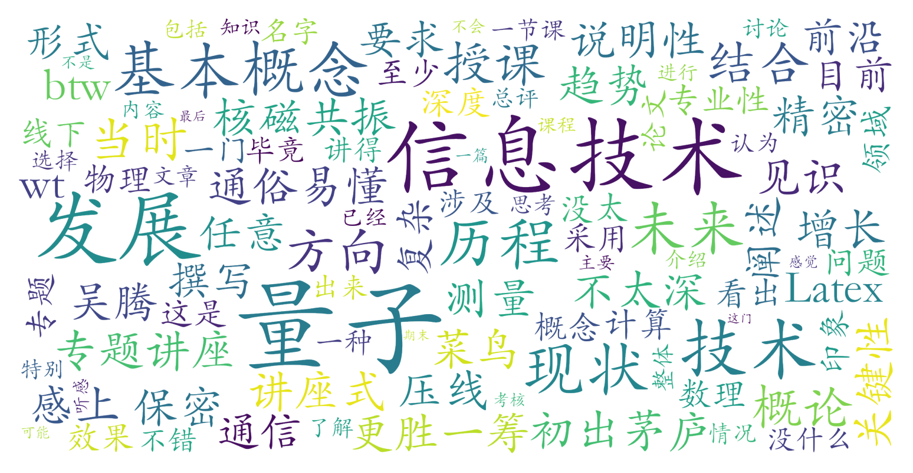

### 量子信息技术概论（信息科学技术学院，2学分）

#### 课程难度与任务量  
作为一门全校任选的通识类概论课，课程内容以讲座式专题展开，无需量子力学或复杂数理基础，适合零基础学生入门。任务量集中于两周密集授课（每日连续4节课），课后仅需完成一篇期末论文（要求用LaTeX撰写）。论文主题需结合课程内容对某一量子技术方向进行综述性分析，虽涉及前沿领域但专业性要求较低，整体课业压力较小。

#### 课程听感与收获  
吴腾老师采用通俗易懂的讲解方式，通过16个专题系统介绍量子物理基础概念、量子计算/通信/精密测量等核心技术的原理与发展现状。课程内容兼具广度与时效性，有助于学生快速建立对量子信息领域的认知框架。线上授课形式虽能完成知识传递，但学生反馈线下可能更利于互动与理解深化。需注意课程内容偏科普性质，技术细节探讨有限。

#### 给分好坏  
考核仅以期末论文定成绩，学生反馈给分较宽松：在论文深度要求不高的情况下，认真完成说明性内容即有较大概率获得90分以上（总评区间[90,95)）。测评未提及强制正态分布限制，推测教师可能通过灵活调整评分标准保证优秀率。

#### 总结与建议  
本课适合对量子科技感兴趣、希望快速了解前沿动态的非理工科学生，尤其推荐给时间有限但想轻松获得高学分的选课者。对于信科等理工科学生，建议将其作为专业课程的补充拓展而非核心学习内容。选课后需注意：  
1. 密集授课需做好两周高强度听课准备，建议提前了解量子领域基础术语  
2. 论文选题宜尽早确定，可结合课程专题中的兴趣点进行延伸  
3. LaTeX排版要求可能对新手构成挑战，建议预留格式调整时间  
作为短期高性价比的科普型课程，其低门槛与高给分特性使其成为通识选修的优质选项。
