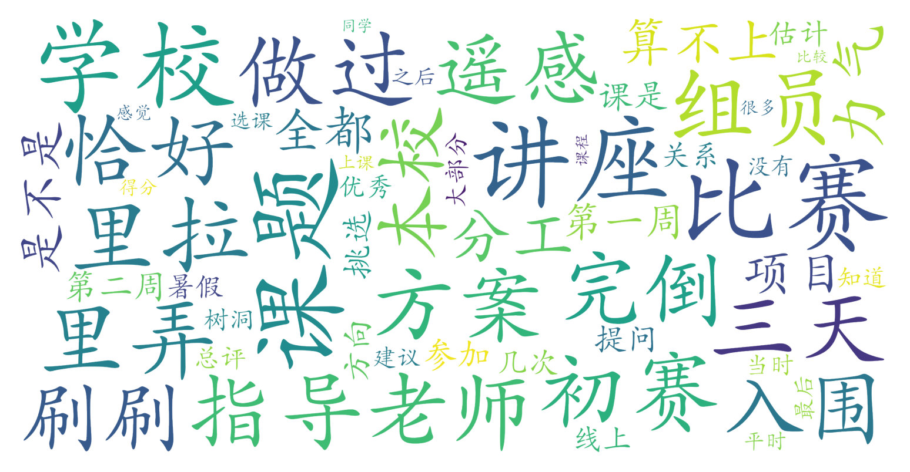

### 北斗系统与时空智能（地球与空间科学学院，2学分）

#### 课程难度与任务量  
课程采用短期高强度实践模式：第一周为系列讲座（可选择性参与提问刷平时分），第二周需在3天内完成组队、选题、分工并产出课题方案。对缺乏项目经验的本校学生而言，初期组队与课题设计存在一定挑战，但指导老师会提供方向性建议，实际任务量集中在第二周冲刺阶段。无传统考试，最终成绩主要取决于项目完成度和参与度。

#### 课程听感与收获  
课程内容偏向应用型，讲座内容可能与实际项目关联度有限，但实践环节通过与遥感所指导教师的互动，能快速掌握北斗系统应用落地的流程框架。线上形式降低了课堂沉浸感，但项目实践中团队协作能力、快速学习能力得到锻炼，适合对卫星导航技术应用场景感兴趣的学生。

#### 给分好坏  
尽管部分小组项目未入围总评，但积极参与者仍可获得优秀成绩（85分以上）。评分体系包含平时提问参与度（约20%）和项目完成度（约80%），未提及正态调整限制，作为任选课整体给分较宽松。

#### 总结与建议  
推荐给两类学生：① **短期实践导向者**——能接受高强度团队协作突击项目；② **北斗技术探索者**——希望快速了解卫星导航应用但无需深入理论。建议提前联系遥感所相关导师获取选题支持，组队时注意吸纳有编程/方案设计特长的成员。因课程周期仅两周且含暑假时段，需提前规划时间避免与其他事务冲突。
