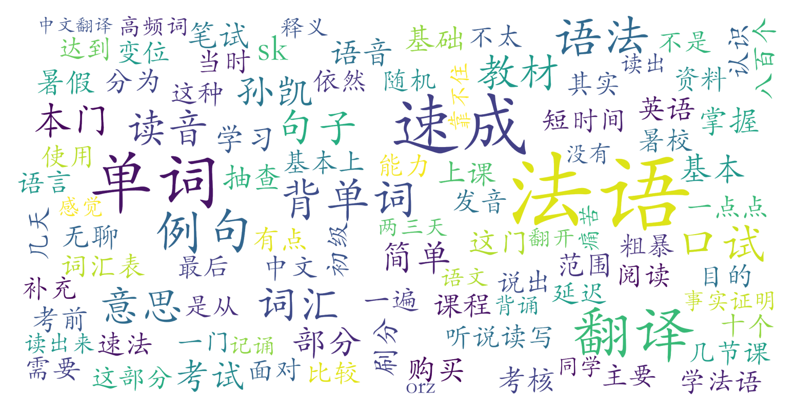

### 速成法语（零起点）（外国语学院，2学分）

#### 课程难度与任务量  
课程以高强度背诵为核心，要求学生掌握800-1453个与英语差异较大的法语核心词汇，辅以基础语法规则讲解。暑校课程安排密集（每周8节课，持续3-4周），部分学期需每日投入1-2小时背诵单词。期末考核分为口试（抽背单词读音及中文释义）和笔试（法译中开卷翻译），口试容错率较低，突击备考存在风险，但翻译题因允许参考资料且批改宽松，整体难度可控。需注意课程教材需自费购买（60-90元），但实际使用率因人而异。

#### 课程听感与收获  
课程聚焦法语阅读能力培养，采用孙凯自创的“1413教学法”，通过对比英语词根差异快速扩展词汇量。教师授课风格幽默，穿插名言谚语和趣味例句，但语音规则讲解较粗糙，语法教学浅显，缺乏听说训练。课程内容与教材高度绑定，部分学生认为例句难度偏高，课堂形式单调（如反复播放录播视频），适合以应试或刷分为目标的学生，但对希望系统学习法语者帮助有限。

#### 给分好坏  
总评普遍集中在87-95分区间，少数学生可获95+甚至满分（🌈）。考核以期末为主，口试（占比约40%）要求精准记忆单词，笔试（占比约60%）依赖翻译质量，部分年份存在“答案趋同但给分慷慨”的现象。无签到和平时作业压力，但需注意：突击背诵可能导致口试失误（如网卡、紧张遗忘），而翻译部分若借助专业修改可能显著提分。近年给分存在波动，建议参考当学期统分洞数据。

#### 总结与建议  
**适合人群**：暑假时间充裕、需刷分保GPA、能接受高强度背诵且对法语阅读有初步兴趣的学生。  
**避雷提示**：追求全面法语能力（如口语/听力）、厌恶机械背诵、期望通过课程培养语言兴趣者慎选。  
**学习建议**：  
1. **词汇优先**：考前集中突破单词背诵，利用词根分类记忆法提高效率；  
2. **翻译策略**：机翻初稿+人工润色（可寻求法语专业帮助）；  
3. **教材取舍**：二手教材或PDF版本足以应对考试，无需盲目购买新课材；  
4. **时间管理**：暑校课程强度高，建议提前规划背诵周期，避免考前突击。  
**综合评价**：作为“功利性”选修课，其任务量适中、给分友好，但教学深度有限，更适合作为法语学习的“跳板”而非系统入门选择。
