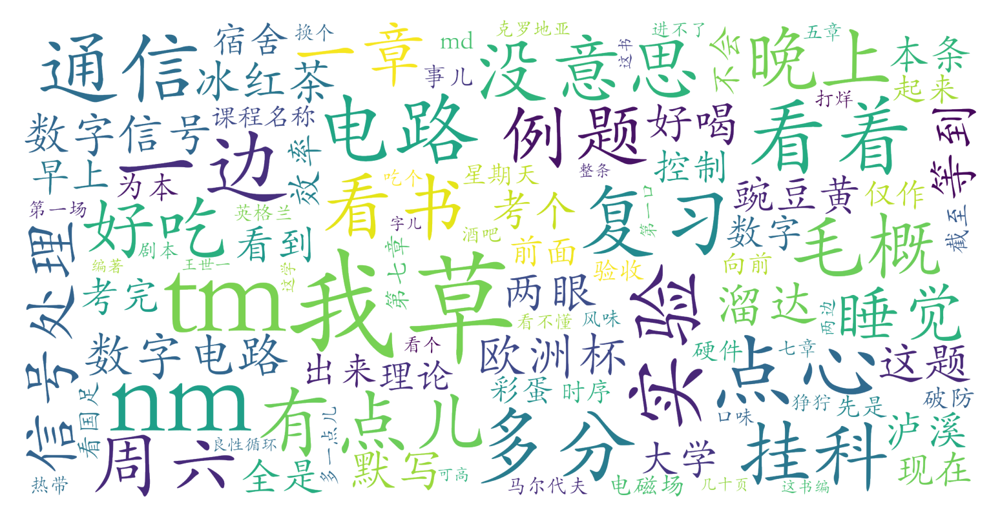

### 恭喜你发现了彩蛋内容！

### 《考试周破防》 by 向前的赵

现在是6月13号，晚上的8点36，星期天。

草。
md。

18号，数字信号处理，一章没看。
19号，数字电路，还行。还剩第七章时序逻辑，一大章，没看。前面的看了，题也不会做。
21号，毛概，等到20号再背。
20号，还有电磁场理论的实验。
我nm，16周还做实验？我草。

明天中午1点，验收通信电路的...软件实验。
16号，截至提交通信电路硬件实验的实验报告。

我草。怎么nm上个大学这么多事儿？

周...周五到周六那晚上，通宵。先是看国足比赛，踢马尔代夫，1点开始，看到个3点。3点正好了欧洲杯第一场，草。看到5点，5点睡觉，睡到11点起来，就是周六了。

周六晚上，出去打剧本杀去了。结果nm打到12点，回不了宿舍了，我草。
tm在tm酒吧待了一晚上。就这这...一个待到3点，不让待了，打烊儿了，换个待，待到5点，溜达溜达6点。早上回宿舍，睡觉，睡到下午2点，起来又没干什么。

tm数字信号五章呀，一章没看。

哎呦，我草。

我nm。（狰狞）

19号考完数字电路，20号还得做实验，21号就得考毛概，21号考完毛概，22号就剩一天，23号就考通信电路，通信电路七章，一章没看。

我nm，这怎么这么紧呢你？
多tm给几天不行啊？我草。
真是草了。

这个口味儿的冰红茶还挺好喝的，热带风味儿。
吃个点心。

现在是8点40多，40多一点儿。等到9点，再看...英格兰踢克罗地亚的欧洲杯。
（吃第一口点心）

因为我发现，一边看球，一边看书，效率挺高的。
一直看球吧，看着看着就困了，没劲。看着一会儿半天进不了球，0比0，两边在那捣。也没意思。
你看着没意思吧，看两眼书。
看书看两眼，书也没意思...看不懂。再看个球。

这就是 良性循环。
一边看球一边看书，效率可高了。
一整条俩小时，能看几十页书呢。

就nm这学的课，看一遍书nm也不会做题啊！我草。
你这...我觉得这...你前面这讲的跟这题，关系不大。

你这..谁写的这个数字信号处理这书，绿不啦叽的。
看一眼，王世一编著。
长这样。（贴贴）草，这样啊这样。

哎就这书编的，一道例题都没有，全是字儿，全是话。你不给例题我知道题怎么做呀？
（吃第二口点心）
那考试又不是考默写，你要考默写我就给你背下来。
那做题，好歹给个例题啊。

腻啦吧唧的，不好吃，有点儿像豌豆黄儿。里面还有什么，红豆儿啊什么之类的。
还没有我那冰红茶好喝呢！

但是他那个，乳酪儿蛋黄儿还挺好吃的。刚才吃了两个。
这叫什么...泸溪河，泸溪河。
这有点儿腻，黏不啦叽的，又不是北...老北京那种豌豆黄儿。但是他有点儿那个，豌豆儿那感觉。
应该是什么豆儿磨的面儿捏的一个糕儿。

没吃过这种以前，也不好吃。
（吃第三口点心）

哎呦，真复习不过来了，我草。
也不能挂科啊，挂科不就废了吗。

你要想不挂科，怎么着也得复习到80多分的水平，你最后考出来才能考个60多分。
你要是想考个80多分，85以上，那你都得冲着100分复习。

就是你这卷子什么都会，咣咣咣都写出来了，对于我来说啊，我最后也就能考80多分。
我现在tm什么都不会呢，到时候复习个60分的水平，考出来也就40分。

真完蛋，我草。
之前考那个**控制理论基础**啊，你学电子信息，这控制理论基础都不用学多难。
才上了八周课，我还复习了一周呢。

老师还说这题简单，不用往深了复习。
结果，好家伙，考试的时候连tm计算器都没来得及摁。题太多了，一直在那写。

这腻，这不好吃这东西。

行...准备看球，看书。
太...太浪了这周末。这大学这时...时...大学这...这些时光里没有这么浪过。
连通俩宵，这是一般人能顶得住的吗？太累了。
嗯...今天得把这时差给倒回来。

要是再是12点钟清醒，早上6点开始睡觉，这tm下周别玩了，重开吧我就。

还有四天的复习时间。
奥利给！（举手）
干了兄弟们！
冲！

这tm数字信号，有什么难的？看呗 ！
不会就问。
拜拜。
