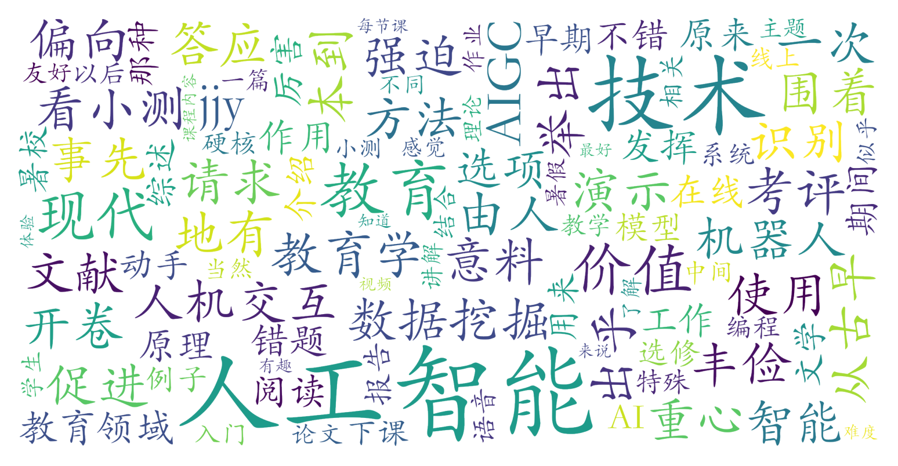

### 教育与人工智能（教育学院，2学分）

#### 课程难度与任务量  
课程定位为入门级人工智能应用课，无需编程或教育学基础，适合跨学科学生。任务量适中，主要包括**开卷在线小测、文献阅读报告/主题论文、实践体验活动**，暑校期间完成大作业的难度可自主选择。测评显示学生普遍认为课程“丰俭由人”，时间投入集中在期末阶段，平时无硬性作业要求。

#### 课程听感与收获  
教师采用**案例驱动教学法**，通过演示视频、AI工具实操（如AIGC、智能错题本）与教育场景结合，帮助学生理解人工智能技术在教育中的实际应用。课程内容覆盖从传统人机交互到前沿技术，但更侧重应用价值而非技术原理。学生反馈“强迫自己了解和使用AI技术”是主要收获，但对深度学习理论或教育学方法论的系统性讲解较弱。

#### 给分好坏  
成绩构成清晰透明：文献报告/论文（约40%）、开卷小测（约30%）、日常参与（约30%）。多位测评者强调“给分超出预期”，推测教师可能通过宽松评分或隐性调分保障优秀率。无签到要求，对课程参与度的考核主要通过作业完成度体现。

#### 总结与建议  
该课程适合两类学生：① **非技术背景但对AI+教育交叉领域感兴趣者**，可作为通识拓展；② **希望快速了解AI工具教育应用场景的实践导向型学生**。建议选课后重点参与课堂演示互动，大作业优先选择与自身经历结合的选题（如教育实习案例）。需注意课程理论深度有限，不适合追求硬核技术学习或教育学系统训练的需求。
