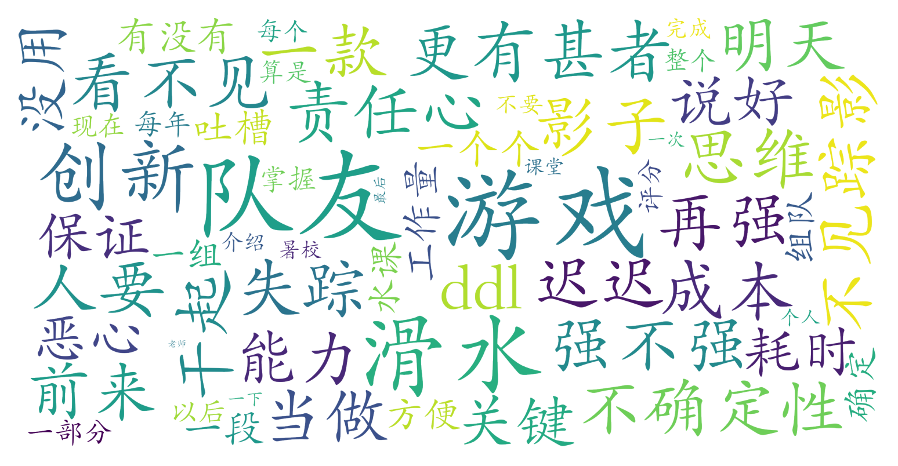

### 游戏化创新思维（教育学院，2学分）

#### 课程难度与任务量  
课程以小组合作开发游戏为核心任务，团队项目占比重大且耗时长。测评显示，5人组队需在21天内完成游戏设计开发，但实际执行中可能出现任务分配不均、队友划水等问题，导致部分学生需承担80%以上的工作量。课堂内容涉及游戏化创新理论，但学生反馈“课堂水”且“掌握成本高”，表明理论教学与实践衔接可能存在不足。课程时间集中在1-2周内高强度完成，需预留大量课余时间应对突发任务。

#### 课程听感与收获  
授课教师尚俊杰被评价为“人很好”，但课堂节奏和内容质量存在争议。分组讨论需占用大教室，可能体现课程对互动性的重视，但学生认为“课堂水”，暗示教学深度或引导效果有限。课程目标或聚焦于培养创新思维和团队协作能力，但实际收获因团队执行力和个人投入差异较大，部分学生可能因队友划水而体验不佳。

#### 给分好坏  
测评未明确总评构成与给分标准，但提到“评分现在不确定”，推测成绩可能与团队项目成果强相关。由于是全校任选课，可能未受正态分布严格限制，但组内贡献度差异可能导致个人得分波动较大。需警惕队友划水带来的评分风险，建议提前确认组员责任分工。

#### 总结与建议  
**适合群体**：对游戏设计或创新方法有强烈兴趣、擅长团队协作且抗压能力强的学生。  
**慎选人群**：追求轻松拿学分、不擅长协调团队任务或时间紧张者。  
**学习建议**：  
1. **组队策略**：优先选择责任心强、沟通顺畅的队友，避免仅关注“能力强”但划水风险高的成员；  
2. **项目管理**：提前制定分工计划并设置阶段性检查点，降低DDL前集中爆雷的可能性；  
3. **主动沟通**：遇到队友失联及时向教师反馈，争取调整组别或获得指导支持。  
**课程定位**：作为一门实践导向的创新类课程，其价值更多体现在团队协作与项目落地的经验积累，而非理论知识深度，适合将其作为课外能力拓展的补充选择。
