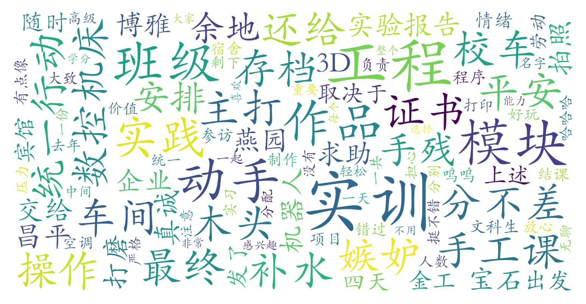

### 工程实训B（材料科学与工程学院，2学分）

#### 课程难度与任务量  
课程以实践操作为主，包含机器人编程、木工雕刻、数控机床、宝石打磨、3D打印等多个模块，动手能力要求因具体项目而异。文科生和动手能力较弱的学生反馈任务难度适中，教师会提供充分指导。任务量集中在4天左右的集中授课期（含企业参访），需完成作品制作、实践报告及最终考核，暑期上课需注意昌平校区环境条件（如部分车间无空调）。

#### 课程听感与收获  
课程设计新颖有趣，实践性强，包含企业参访和团队协作环节，能直观体验工程流程。教学团队整体耐心负责，不同模块由专业教师指导，学生可随时求助。课程注重“做中学”，通过实物作品展示学习成果，部分学生认为“像高级手工课”，对劳动教育目标契合度高，但兴趣程度可能因个人偏好产生分化。

#### 给分好坏  
总评成绩主要基于作品完成度与实践报告，考核形式灵活无考试压力。测评显示给分较好（普遍90+），教师会根据参与态度适度调分，动手能力较弱的学生也能获得较高成绩。未提及正态或硬性优秀率限制，推测劳动教育课评分标准相对宽松。

#### 总结与建议  
适合以下学生选择：  
1. 需要劳动教育学分的各院系学生；  
2. 对工程实践感兴趣的非工科生（无需先修知识）；  
3. 偏好动手操作而非理论学习的学习者。  
建议提前确认暑期课程时间安排，携带必要防暑物品，实践报告中注重过程反思而非技术深度。课程兼具趣味性与实用性，是北大少有的沉浸式劳动教育课，推荐作为通识选修补充。
