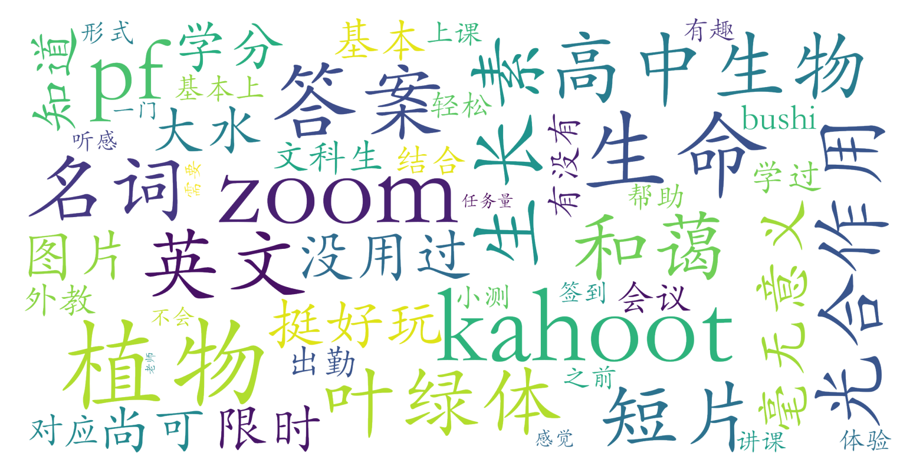

### 植物知道生命的答案（现代农学院，2学分）

#### 课程难度与任务量  
课程采用全英文线上教学（Zoom平台），任务量整体较轻。学生需掌握高中生物基础概念（如叶绿体、光合作用等）并具备对应英文术语能力，课程中通过Kahoot限时答题进行课堂互动与签到，文科生反馈“基本靠蒙也能通过”。课程时间安排密集（1周内每日2-7节），但测评显示实际投入精力较少，适合短期集中完成。

#### 课程听感与收获  
外教Daniel Chamovitz授课风格生动有趣，教学内容以纪录片片段展示与Zoom讲解结合，能帮助建立植物学基础认知。课程设计注重趣味性，Kahoot互动环节被形容“好玩”，但对英语听力有一定要求。由于内容偏向科普性质，专业深度有限，适合对生命科学感兴趣但无进阶需求的学生。

#### 给分好坏  
采用Pass/Fail制（仅记录合格/不合格），不参与GPA计算。通过门槛较低，按时参与Kahoot签到并完成基本任务即可合格。测评未提及具体成绩构成，但文科生明确表示“凑学分可选”，推测无考试压力或论文要求。

#### 总结与建议  
该课程定位为**零门槛通识课**，推荐以下群体选择：
1. 需要快速获取学分（尤其是跨年级/专业补学分）
2. 对植物学有浅层兴趣且能适应英文授课
3. 接受线上教学模式与短期密集课程安排

**注意事项**：
- 建议提前熟悉生物专业名词英文表达
- 需保证Kahoot签到参与率（影响合格判定）
- 不推荐追求学术深度或GPA提升的学生选课

课程本质是兼顾趣味性与实用性的“工具型课程”，在北大通识课体系中属于典型的事少易过类选项。
