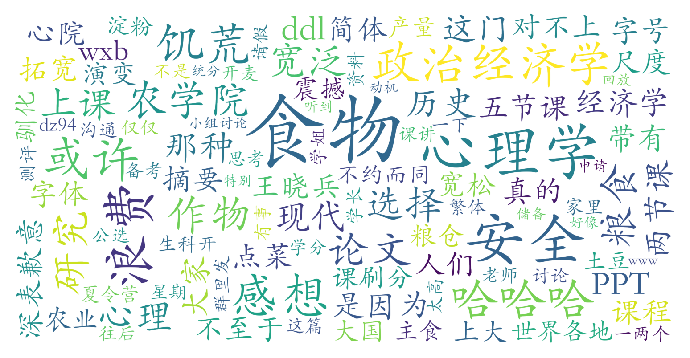

### 课程名称（现代农学院·全校任选·2学分）

#### 课程难度与任务量  
课程任务量极轻，核心要求为提交一篇2000字课程论文（占比90%），主题可围绕课程内容自由选择，允许纯感想或结合研究性内容。论文无需严格学术格式，但需注意字体统一。小组讨论与出勤仅占10%，学生反馈表明可通过课程回放与PPT自学完成作业。无考试安排，论文DDL灵活且可申请延期，适合时间紧张的学生。

#### 课程听感与收获  
课程内容聚焦于食物安全的历史案例（如大饥荒）、经济政策与心理行为（如消费选择），较少涉及农业技术细节。教师通过展示历史资料、组织课堂互动（如讨论食物浪费）增强参与感，但部分学生认为学科交叉深度有限。PPT与课程回放质量较高，自学效果良好。总体而言，课程能拓宽跨学科视野，适合对社会科学视角下的食物议题感兴趣的学生。

#### 给分好坏  
给分极为友好，统分洞（学生成绩共享平台）显示多数学生获得90+高分。总评构成透明，论文质量是决定性因素，但未出勤者可能略微影响分数（如某测评者自述因缺课导致分数略低）。教师对论文评分宽容，即使延迟提交仍可获得94.5分，无“正态”压分现象。

#### 总结与建议  
该课程是典型的“刷分神课”，推荐以下群体选择：  
1. 需提升GPA或完成选修学分要求的学生；  
2. 对跨学科议题感兴趣但无特定专业基础者；  
3. 暑期课业压力大、希望灵活安排时间者。  
**学习建议**：优先通过回放与PPT掌握课程框架，结合个人兴趣选择论文方向（如心理学背景者可侧重消费行为分析），适度参与课堂讨论以争取额外加分。论文避免纯流水账式感想，建议融入课程核心概念（如政治经济政策对食物分配的影响）以提升分数竞争力。
