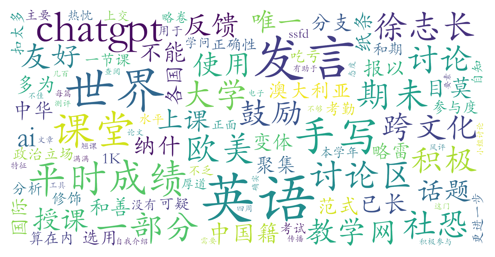

### 世界英语与英语世界(C级)（英语语言文学系，2学分）

#### 课程难度与任务量  
课程为C级英语暑校课，授课语言为全英文，要求学生具备一定英语交流能力。每周需连续四天参与早八课程，考勤通过手写签名严格执行，无法翘课。任务量中等偏上：需完成3篇几百词的小报告（分析世界英语相关主题）和1篇期末开卷论文（1000词左右，允许使用ChatGPT等工具辅助）。期末考试形式灵活，但写作量较大。课堂讨论频繁，对社恐学生有一定压力。测评显示，合理利用AI工具可提升作业质量，但过度依赖可能导致基础能力不足的学生吃亏。

#### 课程听感与收获  
徐志长老师授课风格贴近欧美大学课堂，内容聚焦“世界英语”学术领域，涵盖各国英语变体特征、跨文化传播等专业议题。课堂互动性强，鼓励自由发言和小组讨论，教师对学生的观点普遍给予积极反馈。PPT内容详实，结合学术前沿案例，但对部分涉及敏感政治立场的跨文化材料需谨慎辨析。课程能有效拓宽学生对英语全球化应用的理解，适合对语言学、跨文化交流感兴趣的学生。

#### 给分好坏  
总评构成多样：平时成绩（20%，含考勤与课堂参与）、作业（30%）、期末论文（50%）。测评者反馈，积极参与讨论区发言或课堂互动可提升平时分，但并非全勤即满分。往年因“欧美式给分”（80+难拿）风评不佳，但近年调整后给分趋于北大平均水平，高分比例增加。有学生因作业仓促完成、发言较少最终得分80-84，认为给分中规中矩，未出现明显“正态”压制。

#### 总结与建议  
适合英语表达能力强、愿意主动参与讨论的学生，社恐需谨慎选择。建议：  
1. **善用AI工具**：ChatGPT可优化语法和论述逻辑，但需确保内容原创性；  
2. **平衡投入方向**：讨论区发言可作为课堂参与的有效替代，减轻当面发言压力；  
3. **提前规划写作**：避免期末集中赶工，分散完成作业更易保证质量。  
该课对跨文化研究或英语学术写作训练有较高价值，推荐相关方向学生选修，但需做好早八出勤和互动准备。
