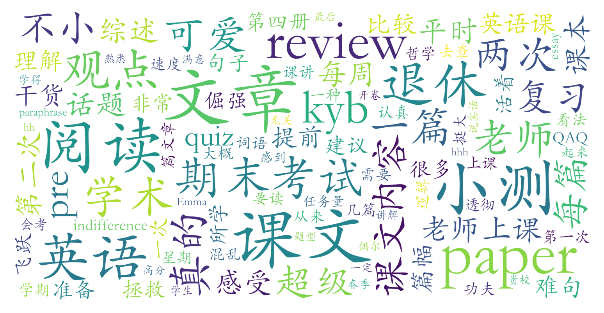

### 学术英语阅读(C级)（英语语言文学系，2学分）

#### 课程难度与任务量  
课程任务量因授课教师差异较大。珂彦玢老师班任务量显著偏高：每周需预习2-3篇1500-3000词学术文章，涉及科技、哲学、社会等多领域；课内讲解节奏快，直接切入重难点句分析，需课前充分准备。考核包括两次小测（覆盖10-24篇课文重点词句与理解）、1次小组pre、1篇1000词综述论文（需结合3篇以上课文观点）和期末开卷考试（3500-4000词新文章阅读）。方舒琼（Emma）老师的班级任务量相对适中：课后无强制作业，期末复习压力较小，但文本难度仍较高，需运用课堂阅读技巧。

#### 课程听感与收获  
珂彦玢的课程以思想深度著称：选文质量高且主题多元，课堂融合文本分析与人生哲思（如教育本质、心灵困境等），部分学生反馈“课程重塑了精神世界”。教师授课风格鲜明，既有学术严谨性又具人文关怀，但需适应其“倔强”观点表达。**Emma** 的班级更侧重实用技能培养：课堂补充大量阅读策略与跨学科知识，授课生动活泼，文本类型丰富但难度梯度平缓。两位教师均强调逻辑思维训练，长期投入可显著提升学术英语阅读与批判性写作能力。

#### 给分好坏  
珂彦玢老师给分慷慨但存在正态风险：总评构成中期末占60%，小测与论文各占20%-10%。教师会通过调分（如允许论文重写）帮助努力者，高分段（90+）比例较高，但部分学生因正态卡至84-89分。Emma的给分更稳定：期末开卷且与课文无关，平时任务完成度高的学生易获90+，小测范围虽广但教师会提前明确重点。两位教师均不考勤，最终成绩侧重学习过程表现。

#### 总结与建议  
珂彦玢的课程适合：①英语基础扎实（高考英语135+/托福100+）且愿投入每周8-10小时深度学习的学生；②希望从人文视角提升思辨能力的文科生。Emma的班级更适合：①追求课程干货与任务量平衡者；②需系统训练学术阅读技巧的理工科学生。若选珂彦玢班，建议：①建立课文生词本与观点索引表应对小测；②论文需突出逻辑主线与个人见解；③主动与教师沟通调整学习策略。需注意kyb可能临近退休，选课机会有限。
