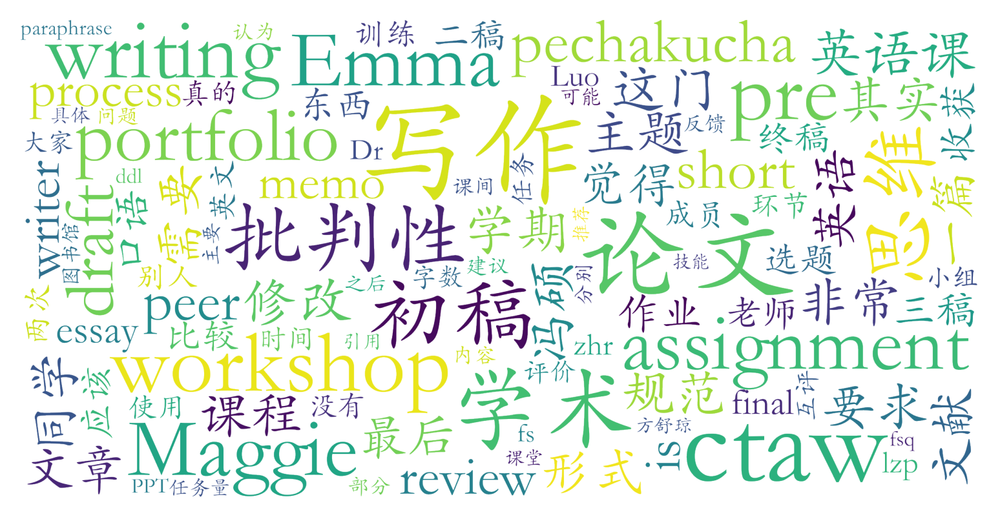

### 批判性思维与学术写作(C+级)（英语语言文学系，2学分）

#### 课程难度与任务量  
课程以完成一篇1500词学术论文为核心任务，涉及选题、文献检索、多轮修改及PechaKucha形式展示。任务量中等偏大，初稿撰写阶段需投入较多时间（约10小时/周），后续修改和互评压力相对分散。部分班级需完成3次短写作任务（如文献综述、大纲拟定），期末需提交包含多稿论文的Portfolio。课程无考试，但时间管理要求较高，尤其与期中/期末周重叠时可能产生压力。

#### 课程听感与收获  
**教师差异显著**：  
- **罗正鹏（Dr. Luo）**：授课清晰，注重写作规范与文献管理（如EndNote使用），邀请图书馆教师讲解检索技巧，课堂互动轻松，但内容偏向人文社科。  
- **冯硕（Maggie/fs）**：课程设计成熟，强调“写作即过程”，通过Workshop强化修改意识，课堂穿插趣味素材（如脱口秀），适合学术写作入门。  
- **张欢瑞（zhr）**：内容偏向社科，理工科学生反馈收获有限，但教师亲和力强，提供详细Office Hour指导。  
- **方舒琼（Emma/fsq）**：融入批判性思维训练（如辩论、广告分析），课堂口语互动多，但分组水平不均可能影响效率。  
**通用亮点**：PPT质量高，涵盖学术写作全流程（引用规范、逻辑谬误识别等），Workshop互评环节对优化论文帮助显著。

#### 给分好坏  
- **优秀率较高**：C+级课程优秀率可达60%-70%，多数班级90分以上占比大，部分学生反映正态下限为84分。  
- **评分透明**：总评构成通常为考勤15%+短作业15%+Pre 20%+Portfolio 50%，注重论文修改进步而非终稿质量。  
- **教师差异**：冯硕班给分最优（90±3分常见），张欢瑞班存在正态风险，方舒琼班反馈速度影响评分体验。

#### 总结与建议  
**适合人群**：推荐大一/大二学生选修，尤其适合人文社科方向或需学术写作基础者；理工科学生若对社科选题无兴趣，收获可能有限。  
**选课建议**：  
1. **教师优先**：冯硕班综合口碑最佳，罗正鹏班实用性强，张欢瑞班需警惕正态，方舒琼班适合热衷互动者。  
2. **时间规划**：初稿阶段尽早启动，利用Workshop反馈迭代修改；Pre需针对性训练时间把控能力。  
3. **学习策略**：注重“写作过程”理念，积极参与互评；若选PF制，可减少终稿投入但仍需保证基本完成度。  
**注意**：课程内容版权严格，勿外传课件；2023年后教师变动频繁，建议选课前确认开课教师。
