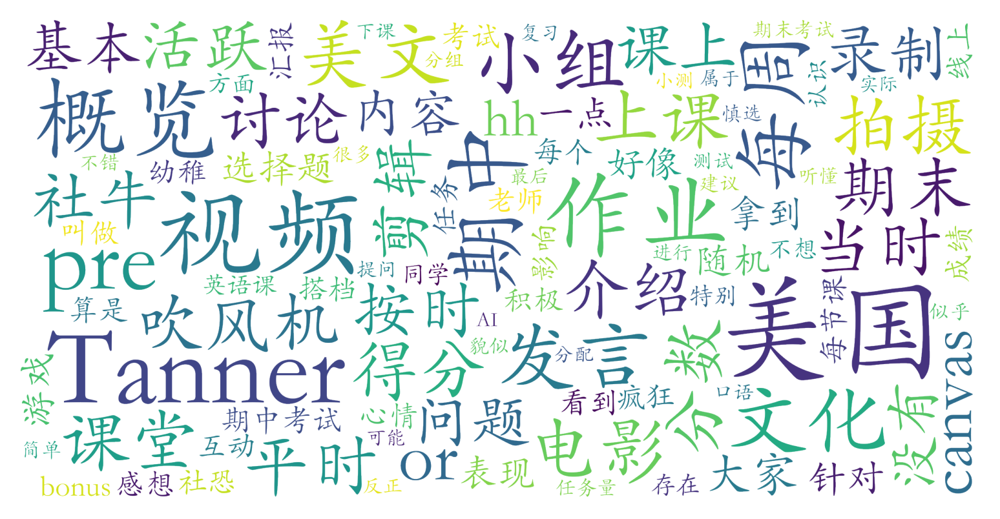

### 美国文化概览(B级)（英语语言文学系，2学分）

#### 课程难度与任务量  
- **Tanner老师班**：任务量中等偏轻松，每周需完成观影作业（配合1页英文感想或讨论板回答），课堂穿插小组活动（如即兴表演、视频创作）。期中为双人/小组pre（主题为美国文化相关），期末需提交3-5分钟个人/小组视频（内容与美国文化影响相关）。无考试，但部分学期有线上常识性小测。  
- **其他教师班（如Ptseu、Angela Geddes）**：任务构成类似，但细节差异较大（如Angela班分数构成更细碎，Ptseu班存在优秀率调分限制）。总体任务量可控，但对作业提交规范要求较高。

#### 课程听感与收获  
- **Tanner老师班**：课堂氛围轻松活跃，以游戏、分组讨论、表演为主，弱化传统知识讲授。学生反馈“更像英语表达训练课”，社恐学生可能因频繁互动感到压力，但多数认为对提升口语自信有帮助。  
- **Angela Geddes班**：外教授课节奏适中，内容简单易懂，小组讨论主题明确（如美国州文化、节日等），适合对基础美国文化感兴趣的学生。  
- **Ptseu班**：线上授课时互动较少，任务完成自由度较高，但给分争议较大。

#### 给分好坏  
- **Tanner老师班**：给分存在两极评价。积极参与课堂、认真完成作业（尤其是期中期末大作业）的学生可能获得90+甚至彩虹（100分），但部分学生因作业疏漏或调分限制落入85-89区间。优秀率限制下，存在“吹风机”调分现象（如强行压至84分）。  
- **Angela Geddes班**：外教给分较慷慨，按细分任务累加，较少受正态限制，90+比例较高。  
- **Ptseu班**：存在因优秀率或作业失误导致的调分争议，得分波动较大。

#### 总结与建议  
1. **适合人群**：社牛学生首选（Tanner班互动密集）；对口语表达有提升需求、能接受“形式大于内容”课堂者亦可尝试；抗拒公开演讲或小组合作者慎选。  
2. **学习策略**：  
   - 作业保质提交（可借助AI辅助但需润色），期中期末项目注重创意与完整性；  
   - 课堂表现虽不直接关联分数，但积极发言可能影响教师主观评价；  
   - 若追求高分，建议提前确认教师给分风格（如Tanner班需平衡任务完成度与互动参与）。  
3. **总体评价**：作为B级英语课，任务量适中，给分上限高但存在不确定性。适合希望轻松修读英语必修、同时能接受非传统授课形式的学生。Angela给分更稳定，Tanner班体验有趣但需“佛系”对待分数波动。
