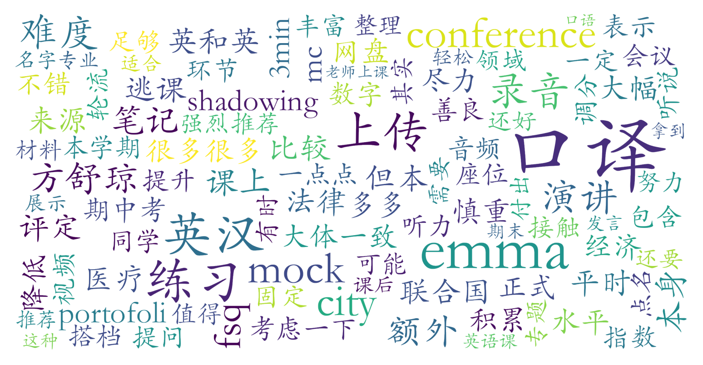

### 英汉口译(C级)（英语语言文学系，2学分）

#### 课程难度与任务量  
课程定位为C级英语课，但实际口译训练强度接近或超过C+级，尤其注重中英双向转换能力。教学内容涵盖数字口译、经济法律医疗等专题，需掌握笔记法、shadowing跟读等专业技能。任务量适中，包括课前MC练习、2次录音作业、期中考试、期末3分钟演讲视频及学习档案整理，每周课内练习为主，若课后自主加练效果更佳。考试难度较高（如期中考试），但教师明确会调分，减轻学生压力。

#### 课程听感与收获  
方舒琼（Emma）老师专业功底扎实，课程设计系统性强，课堂穿插联合国发言等实战材料与趣味内容（如“city不city”梗），注重实操演练。通过mock conference模拟真实会议场景，学生需与搭档协作完成交替传译，对临场反应和语言组织能力提升显著。PPT与讲义内容详实，但课程节奏紧凑，需高度专注。固定座位虽非点名制，但课堂互动频繁（提问、展示等），对内向学生略有压力，但多数反馈体验友好。

#### 给分好坏  
成绩构成多元：平时作业（可反复录音）、mock conference表现、调分后的期中考试、期末视频及学习档案。教师给分宽容，注重学习过程而非绝对正确率，高分机会较多。测评中未提及“正态”限制，推测可能因英语课独立评分规则或教师争取超优秀率，整体给分优于多数英语必修课。

#### 总结与建议  
**适合人群**：英语听说基础较好（建议雅思7+/托福100+水平）、对口译职业感兴趣或希望强化即时语言转换能力的学生。  
**选课建议**：非英语专业但有意挑战高阶语言应用者可尝试，但需做好课后加练准备（如数字敏感度训练）；内向学生需权衡课堂互动要求。  
**学习方法**：善用录音作业反复打磨细节，mock conference前多与搭档磨合，期末档案整理时保留课堂练习痕迹以体现进步。  
**总体评价**：作为北大少数专注口译的英语课，兼具专业性与实用性，方舒琼老师的教学风格与给分政策使其成为英语能力较强学生的优质选择。
