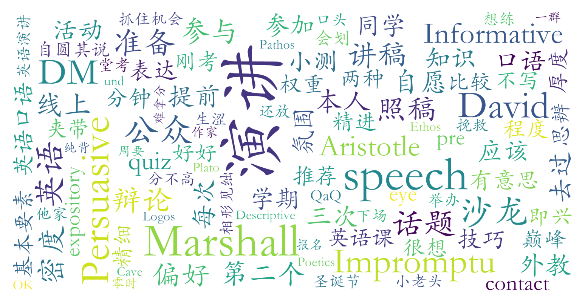

### 英语公众演讲(C级)（英语语言文学系，2学分）

#### 课程难度与任务量  
课程任务量在C级英语课中相对较轻，核心考核为三次演讲（**expository**、**persuasive**、**impromptu**），前两次需提前1-2周准备提纲与讲稿，即兴演讲则要求快速反应。学生反馈实际准备时间弹性较大，部分同学可提前一天完成。期末增设临时小测，内容灵活但知识密度较低。每周课程时间安排密集（1~4周多时段），但课下投入较少，适合希望平衡任务量的学生。

#### 课程听感与收获  
外教**David Marshall**授课风格活泼，注重互动与文化背景融合。课程内容涵盖经典演讲技巧（如亚里士多德的**Ethos/Pathos/Logos**理论）、西方历史与文学案例，并穿插即兴辩论与文本分析。教师对演讲逻辑性和说服力要求较高，会提供针对性反馈。课堂外设有自愿参与的**沙龙活动**（如公寓讨论会），部分学生认为能拓展视野。但需注意，课程对英语口语基础较弱者可能存在压力（如即兴辩论限时严格），口语能力提升效果因人而异。

#### 给分好坏  
总评构成：**三次演讲（73%）+ 期末小测（14%）+ 参与分（13%）**。给分整体偏好，高分集中（有学生总评达90+），但存在**正态调整**（部分学生被压至84分档）。演讲评分注重内容思辨性与表达流畅度，照稿朗读可能扣分（如eye contact缺失）。临时增加的期末小测引发争议，需灵活应对考核变化。

#### 总结与建议  
**适合群体**：  
- 希望轻松完成C级英语学分、对公众演讲感兴趣的学生；  
- 英语口语基础较好，愿主动参与互动并接受即兴挑战者；  
- 对西方文化/文学背景有探索兴趣的同学。  

**慎选情况**：口语薄弱或抵触临场表达者可能压力较大。  
**学习建议**：  
1. 提前构思演讲逻辑框架，避免依赖讲稿；  
2. 关注教师对思辨深度的要求，尤其在说服性演讲中强化论点自洽性；  
3. 参与沙龙活动可能提升课程体验；  
4. 需预留弹性应对考核变动（如临时小测）。  
**总体评价**：任务量友好、课堂氛围活跃，适合作为C级英语的“轻量级”选择，但对口语能力有一定隐性门槛。
