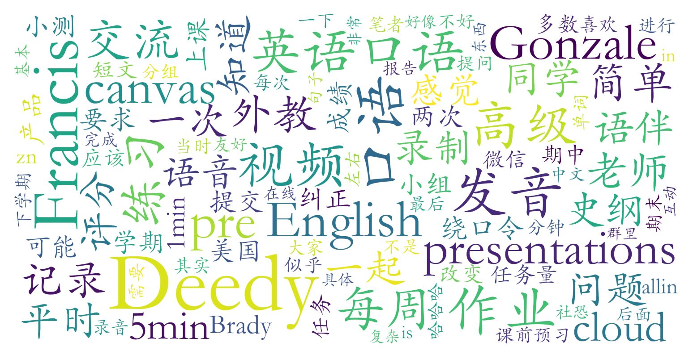

### 高级英语口语(B级)（英语语言文学系，2学分）

#### 课程难度与任务量  
课程任务量因授课教师差异显著：  
- **Deedy Gonzale**：任务量较大，包含4次小组/个人pre（需反复练习与协作）、每日短作业、随机分组互动及期末考试（简单口语面试）。暑校压缩任务至4周，每周投入时间较多。  
- **Brady**：任务量适中，含每周录音、社交记录、期中期末pre（创意主题），注重课堂互动与小组合作，作业完成难度较低但需投入时间准备展示。  
- **Francis**：任务量极小，以录播课为主，每周1分钟录音、语伴记录（可水）及期末小组视频，适合“划水党”。  

#### 课程听感与收获  
- **Deedy Gonzale**：全英文沉浸式教学，通过绕口令、短文朗读、随机分组互动纠正发音，课堂氛围活泼，鼓励自信表达；组织英语角、家庭聚会等活动增强实践。  
- **Brady**：注重交流技巧与创意表达，通过破冰游戏、节日文化介绍、产品设计pre提升口语流畅度，适合喜欢轻松互动与即兴发言的学生。  
- **Francis**：线上录播课互动有限，以发音纠错和文化介绍为主，作业机械性强，收获相对较少，但适合社恐或时间紧张的学生。  

#### 给分好坏  
- **Deedy Gonzale**：总评集中在80-90分，作业与小测差距小，期末调分可能提升最终成绩，优秀率控制较严格。  
- **Brady**：给分较慷慨，作业完成度高的学生易获90+，优秀率按多班级合并计算，部分学生反映95+比例较高。  
- **Francis**：84分“正态兜底”，多数学生获90-95分，作业提交及时性影响成绩上限，优秀率限制明显。  

#### 总结与建议  
- **Deedy Gonzale**：推荐给愿意高强度互动、希望提升口语自信的学生，需适应随机分组和频繁pre，暑校慎选（任务压缩）。  
- **Brady**：适合喜欢创意表达、不排斥小组合作的学生，可关注Cloud评分规则变动，推荐注重实用口语技巧者。  
- **Francis**：适合追求低任务量、线上灵活学习的学生，需注意作业ddl（微信群通知混乱），口语基础较弱者可冲。  
**选课提示**：英语课体验高度依赖外教风格，建议选课前通过树洞/民间群确认当期授课教师，并优先选择Deedy或Brady的班级以获取更高学习价值。
