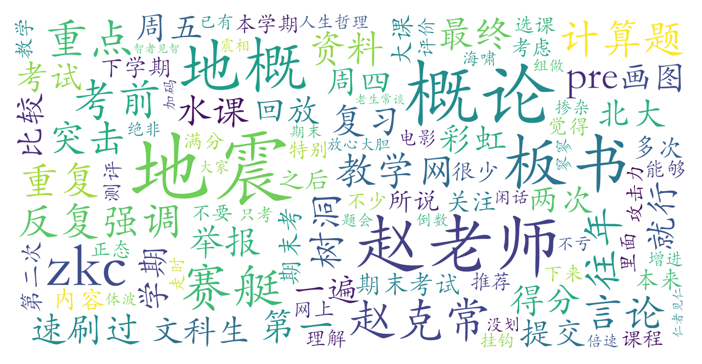

### 地震概论（地球与空间科学学院，2学分）

#### 课程难度与任务量  
课程整体难度较低，任务量较少。作业以教学网重复提交的练习为主，辅以期末报告/Pre（未参与Pre的小组只需提交300字报告）。考试内容侧重课堂板书、重点强调内容及往年题，计算题多为板书原题，部分年份线上考试允许开卷或多次取最高分。每周实际投入时间较少，多数学生通过期末集中复习（约1-6小时突击）即可应对，但需注意赵克常老师多次提及未来可能增加高数相关专业内容。

#### 课程听感与收获  
赵克常老师授课风格幽默，PPT和板书内容清晰便于复习，课程涵盖地震基础知识与防灾常识，具有一定实用价值。但部分学生对其课堂穿插的个人观点（如性别相关言论、课程改革争议等）表示不适。课程不签到且回放完整，多数学生选择翘课并通过回放速刷重点内容，实际到课率较低。需注意期末考试可能涉及其他小组Pre的细节内容。

#### 给分好坏  
给分优秀且调分灵活，总评构成包括作业（可刷满分）、报告/Pre（Pre组略有优势）和期末考试（占比最大）。多数学生得分90+，部分获得满分（“彩虹”），未出现明显正态压制。线上考试曾采取两次取最高分机制，线下考试则需考前突击往年题、板书重点和赛艇/树洞资料，这是高分关键。

#### 总结与建议  
该课适合所有希望轻松获取高分的通识课需求者，尤其推荐给理科生和短期冲刺型学生。建议优先掌握板书重点、往年题（特别是大电影相关题目）和同学期其他班级考题，考前速刷回放或整理资料（5-6页核心内容即可）。需注意：  
1. 赵克常老师部分言论可能引发争议，对课堂价值观敏感者需权衡；  
2. 未来课程可能增加专业难度，但历史测评显示改革警告多为“狼来了”式提醒；  
3. 线上考试红利期已过，线下需更注重板书细节记忆。  
总体而言，作为北大经典“水课”，其低投入高回报特性仍具吸引力，但需理性看待课程实质内容的价值边界。
