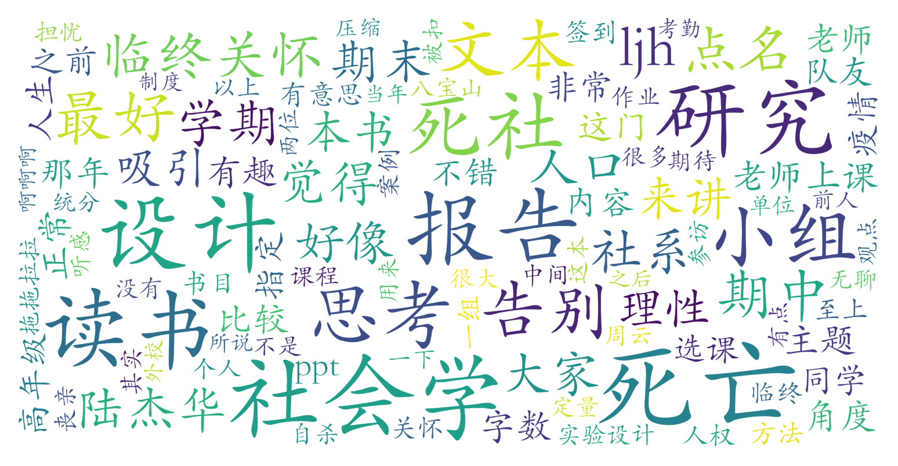

### 死亡的社会学思考（教务部，2学分）

#### 课程难度与任务量  
课程任务量在正常学期相对适中，但暑期课程因时间压缩导致压力较大。核心任务为期中读书报告（《最好的告别》5000-7000字）和期末小组研究设计（1万-1.5万字），部分学生反映暑期版本时间紧张，小组合作风险较高（如外校组员沟通困难）。课程无考试，研究设计需结合社会学方法，对非社系学生可能存在入门门槛，但老师会提供详细指导。整体难度中等，但需注意时间管理和小组分工。

#### 课程听感与收获  
课程内容聚焦死亡相关的社会学议题（临终关怀、丧亲关怀、殡葬制度等），部分学生认为理论框架广度有余而深度不足，授课风格偏平淡，PPT内容较陈旧。亮点在于嘉宾讲座（如临终医院院长、医学部专家）和跨学科视角，能引发对生命伦理的思考。实践环节（如八宝山参访）因疫情常被取消，削弱了课程的体验感。建议结合推荐书目自学（如《温暖消逝》《此生未完成》）以补充课堂内容。

#### 给分好坏  
给分整体较友好，优秀率可能突破常规（部分学期优秀率达70%-80%），但存在出勤严格扣分（占比20%-30%）和正态调整情况（全勤者最低正态分84）。评分构成为：考勤（20%-30%）+读书报告（30%）+小组研究设计（40%-50%）。暑期课程因外校生比例高，可能存在“卷度”差异，但多数学生反馈付出与成绩正相关。

#### 总结与建议  
适合对社会学方法论感兴趣或希望拓展生命伦理认知的学生，尤其推荐社系学生选修。非社系学生需谨慎，建议提前学习基础研究方法或寻找高年级队友。暑期课程慎选（任务压缩+组队风险），正常学期体验更佳。课程理论性强于实践性，若期待深入死亡议题的感性探讨，需降低预期。总体而言，作为通选课，其给分友好性和跨学科视角值得一试，但需做好“社会学研究训练”而非“生死哲学启蒙”的心理准备。
