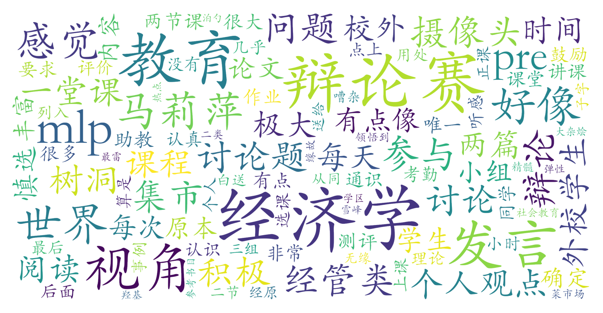

### 经济学视角下的教育世界（教务部，2学分）

#### 课程难度与任务量  
课程无需前置知识，内容以教育经济学案例分析为主，涉及人力资本理论、信号筛选等基础概念，但理论深度有限。任务量较大且形式多样：包含课前阅读（500-800字/次）、课堂发言、小组展示（pre）、辩论赛（需课下准备）和5000字期末论文（占比40%）。暑期课程密集（每天4小时连上两周），作业提交时间紧凑（部分需隔日完成），但部分任务可通过灵活分配时间“水”过。无考试，期末论文是核心考核。

#### 课程听感与收获  
教师授课节奏紧凑，内容偏向社会热点讨论（如学区房、教育公平等），经济学方法论涉及较少，被学生形容为“政治课式大杂烩”。课堂互动性强，鼓励自由发言与小组合作，但暑期班因含50%校外学生，讨论环节常显嘈杂。线上课程通过分组讨论和辩论赛增强参与感，线下体验可能更佳。PPT与阅读材料质量较高，适合希望拓宽社会视野的非经管类学生，但对经管背景学生而言内容可能重复基础概念。

#### 给分好坏  
总评构成复杂（签到5%+课前作业35%+发言10%+辩论10%+论文40%），优秀率控制相对宽松。积极参与辩论赛（胜方可获额外加分）和高质量论文是高分关键，多名学生反馈90+甚至95+，理科生也有机会获得98分。但存在两极评价：部分学生认为“付出与回报成正比”，也有学生因未充分参与或助教评分争议感到不满。

#### 总结与建议  
**适合人群**：对教育社会问题感兴趣、愿意投入时间参与讨论的非经管类学生（经管生慎选）。  
**学习建议**：  
1. 优先保证辩论赛表现与论文质量，课前作业可适度简化；  
2. 主动发言（需达到最低次数要求）但避免“恶意内卷”；  
3. 利用小组合作减轻任务压力，注意组员分工协调。  
课程设计注重思辨能力培养，暑期密集授课模式适合时间充裕者，但对任务量敏感或追求硬核经济学训练的学生需谨慎选择。
