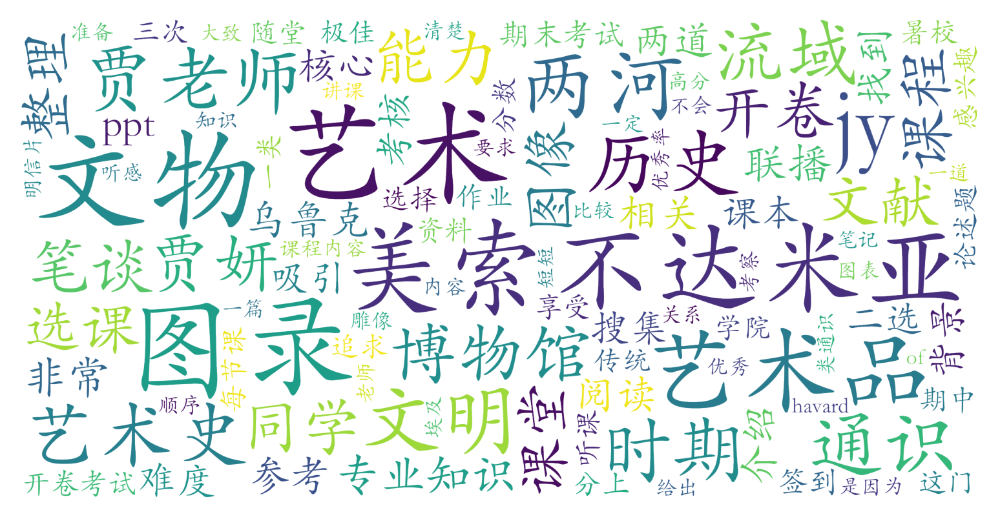

### 美索不达米亚艺术与文明（教务部，2学分）

#### 课程难度与任务量  
课程为暑期学校短期高强度授课模式，两周内每天安排4小时课程，内容涵盖两河流域艺术史与文明发展脉络。任务量主要包括**3次文物图录作业（每篇1000-3000字）**和**开卷期末笔谈**。图录作业需查阅大量中英文文献，对资料检索能力要求较高；期末笔谈为开放题（如策展词撰写），注重对课程内容的理解而非死记硬背。整体难度中等偏上，但暑期集中授课可能导致听课疲劳，需较强的专注力与时间管理能力。

#### 课程听感与收获  
贾妍老师授课水平广受好评，课程内容设计严谨，PPT制作精良，结合历史背景与艺术品赏析，兼具学术深度与趣味性。课堂注重引导观察与分析方法（如“图文关系”“艺术母题”等），学生普遍反馈“殿堂级享受”。课程对英语阅读能力有一定要求（需阅读英文教材及文献），但无艺术史背景的同学亦可轻松入门，收获对两河流域文明的系统性认知与艺术鉴赏能力。

#### 给分好坏  
成绩构成为**签到（10%-20%）+三次图录作业（60%）+期末笔谈（20%-30%）**。教师明确遵守40%优秀率限制，但会尽量在允许范围内给高分（84-95分段较集中）。图录作业态度认真、文献翔实的同学易获高分，期末开放题评分宽容。部分学生提到“正态”调整现象，但整体给分友好，理科生亦可取得85+的满意成绩。

#### 总结与建议  
**适合人群**：对古文明、艺术史感兴趣，或希望拓展人文视野的学生；暑校模式适合能接受高强度集中学习的人群。  
**学习建议**：  
1. 课堂笔记至关重要，可参考“通识联播”优秀作业优化图录写作；  
2. 善用博物馆官网、维基百科及学术数据库（如JSTOR）提升文献检索效率；  
3. 无需刻意追求高分，专注理解艺术史研究方法与文明脉络即可获得深层收获。  
课程作为通识核心课，兼具学术性与趣味性，是北大少有的“硬核水课”，强烈推荐对人文领域有好奇心者选课。
