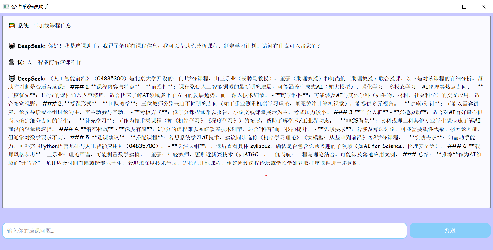

# PKUCourseMate·北大课程管家项目报告

## 一、软件功能介绍

本项目旨在设计并实现一款具有交互式可视化界面的课程信息与测评分析软件 PKU CourseMate，面向北京大学校内师生，提供离线、智能、高效的选课辅助功能。程序整合教务系统课表信息、校园论坛课程测评内容，通过本地展示与智能分析，辅助用户进行课程对比与选择。

<div align="center">

</div>

### 1. 课程查询功能

我们自动化抓取了教务处或选课网开放课表数据，涵盖课程名称、上课单位、时间、地点等信息，您可以通过主页面中的搜索框进行查询。全部数据本地存储，支持离线使用。

<div align="center">

</div>


### 2. 课程测评分析与可视化模块

我们还爬取校园论坛和树洞中的课程历史测评数据，使用大语言模型进行课程提炼，包括教学质量、任务强度、评分情况等，并在界面中使用词云图形化展示课程画像。

<div align="center">

</div>


### 3. 课表预览功能

在每门课课程信息下面有加入课表功能，在主页面点击我的课表即可看到现在加入课表的课程以及其基本信息，双击或者点击删除课程即可删除课程。

<div align="center">

</div>

### 4.选课智能建议模块

我们在软件中加入了deepseek的API，可以帮助用户基于测评分析结果，综合课程特征（如适合人群、给分难度、任务形式）提供课程推荐，课程信息介绍和课程指南功能。

<div align="center">

</div>

## 二、各模块与类设计细节

### 数据处理与可视化

处理收集得到的原始数据，从中抽取课程相关的关键信息，并汇总、格式化为JSON对象统计所有测评文件的tf-idf信息，依据tf-idf的值处理测评信息后，绘制相应的词云图

实现细节

绘制词云图
`utils.wordcloud_draw(context : str, **kwargs)`

将抽取上课时间字符串中的信息，并以元组的形式返回(上课的周数范围，星期几，具体时间)
`utils.convert(item : str) -> tuple[str, int, str | Any, str | None]`

将原始课程信息读入，处理后，汇总为为json对象
`utils.readInfo(path) -> dict[Any, Any]`

统计所有测评的tf-idf，依据tf-idf处理输入的测评字符串
`class utils.WordConstructor`

### QT界面部分

QT 架构如下，箭头表示复合关系


核心类详细设计如下

#### 1. MainWindow（主窗口）  
**职责**：应用入口，协调各模块交互  
**关键属性**：  
- `child_windows: dict` - 子窗口实例管理（课表/搜索/列表/助手）  
- `current_color: QColor` - 当前主题颜色状态  
- `course_details: dict` - 课程数据存储（行列位置→课程信息）  

**核心方法**：  
| 方法                       | 参数                | 功能             | 实现细节                                                         |
| -------------------------- | ------------------- | ---------------- | ---------------------------------------------------------------- |
| `init_ui()`                | -                   | 初始化UI组件     | • 创建自适应布局<br>• 初始化工具栏和搜索栏<br>• 设置初始主题颜色 |
| `set_color()`              | `color: QColor`     | 设置主题颜色     | • 更新主窗口背景<br>• 同步所有子窗口颜色                         |
| `toggle_table_window()`    | -                   | 切换课表窗口     | • 单例模式管理窗口实例<br>• 实现窗口置顶显示                     |
| `add_course_to_schedule()` | `course_num: str`   | 添加课程到课表   | • 转换课程数据结构<br>• 调用课表窗口的添加方法                   |
| `convert_course_data()`    | `course_data: dict` | 转换课程数据结构 | • 解析上课时间及教室信息<br>• 格式化节次范围数据                 |

#### 2. CourseTableWindow（课表管理）  
**职责**：可视化课表管理与冲突检测  
**关键属性**：  
- `course_cells: list` - 7×12课程网格（QPushButton矩阵）  
- `course_details: dict` - 课程详细信息存储  
- `selected_cell: tuple` - 当前选中单元格位置  

**核心方法**：  
| 方法                       | 参数                 | 功能           | 实现细节                                                           |
| -------------------------- | -------------------- | -------------- | ------------------------------------------------------------------ |
| `init_ui()`                | -                    | 初始化课表UI   | • 创建时间轴和日期标题<br>• 构建7×12课程网格<br>• 设置详情展示区域 |
| `add_course_to_schedule()` | `course_info: dict`  | 添加课程       | 1. 冲突检测算法<br>2. 多时间段添加<br>3. 更新父窗口数据            |
| `remove_course()`          | `row: int, col: int` | 删除课程       | • 同名课程多时间段识别<br>• 级联删除关联数据                       |
| `show_course_details()`    | `row: int, col: int` | 显示课程详情   | • 单元格高亮显示<br>• 调用`format_course_details()`                |
| `format_course_details()`  | `course_info: dict`  | 格式化课程信息 | • HTML富文本渲染<br>• 时间安排表格化展示                           |


#### 3. CourseSearchWindow（课程搜索）  
**职责**：实现课程检索功能  
**关键属性**：  
- `dataset_path: str` - 数据集路径（"./dataset"）  
- `course_data: dict` - 加载的课程数据  
- `search_input: QLineEdit` - 搜索输入框  

**核心方法**：  
| 方法                   | 参数                    | 功能         | 实现细节                                             |
| ---------------------- | ----------------------- | ------------ | ---------------------------------------------------- |
| `load_course_data()`   | -                       | 加载课程数据 | • 从info.json读取数据<br>• 异常处理机制              |
| `search_courses()`     | `keyword: str`          | 执行搜索     | • 大小写不敏感匹配<br>• 课程名/教师/课程号多字段搜索 |
| `open_course_detail()` | `item: QListWidgetItem` | 打开课程详情 | • 解析课程路径<br>• 创建CourseDetailWindow实例       |


#### 4. CourseDetailWindow（课程详情）  
**职责**：展示课程完整信息  
**关键属性**：  
- `filepath: str` - 课程数据路径  
- `course_data: dict` - 课程元数据  
- `viewer: MarkdownViewer` - Markdown渲染组件  

**核心方法**：  
| 方法                  | 参数 | 功能         | 实现细节                                              |
| --------------------- | ---- | ------------ | ----------------------------------------------------- |
| `_load_course_data()` | -    | 加载课程数据 | 1. 从info.csv提取课程号<br>2. 从info.json获取完整数据 |
| `parse_time_info()`   | -    | 解析时间信息 | • 转换数字星期为文字<br>• 格式化时间范围              |
| `add_to_schedule()`   | -    | 添加到课表   | • 转换时间数据结构<br>• 调用父窗口添加方法            |
| `init_ui()`           | -    | 初始化UI     | • 左右分栏布局<br>• 词云图片动态加载                  |


#### 5. ChatAssistantWindow（智能助手）  
**职责**：提供AI选课建议  
**关键属性**：  
- `dialog_history: list` - 完整对话历史  
- `chat_history: QTextEdit` - 聊天记录显示  
- `worker: APIWorker` - API请求线程  

**核心方法**：  
| 方法                 | 参数                      | 功能         | 实现细节                               |
| -------------------- | ------------------------- | ------------ | -------------------------------------- |
| `send_course_info()` | -                         | 发送课程信息 | • 构建课程摘要<br>• 注入系统提示词     |
| `send_message()`     | -                         | 发送用户消息 | • 禁用按钮防重复发送<br>• 启动API线程  |
| `append_message()`   | `role: str, content: str` | 添加消息     | • HTML富文本格式化<br>• 自动滚动到底部 |
| `handle_response()`  | `response: str`           | 处理AI回复   | • 添加到对话历史<br>• Markdown格式渲染 |

**对话管理流程**：  
```
用户输入 → 添加到对话历史 → 启动API线程 → 接收响应 → 渲染显示
```

#### 6. APIWorker（API线程）  
**职责**：异步处理AI请求  
**关键属性**：  
- `dialog_history: list` - 对话上下文  
- `api_key: str` - DeepSeek API密钥  
- `api_url: str` - API端点地址  

**核心方法**：  
| 方法    | 参数 | 功能       | 实现细节                                                            |
| ------- | ---- | ---------- | ------------------------------------------------------------------- |
| `run()` | -    | 线程主逻辑 | 1. 构建包含系统提示的消息<br>2. 调用DeepSeek API<br>3. 发送结果信号 |

**消息结构**：  
```python
messages = [
    {"role": "system", "content": "你是一个专业的选课顾问..."}
] + self.dialog_history
```

#### 7. MarkdownViewer（Markdown渲染）  
**职责**：渲染课程分析报告  
**关键属性**：  
- `web_view: QWebEngineView` - 网页渲染组件  
- `current_md: str` - 当前Markdown内容  
- `current_path: str` - 当前文件路径  

**核心方法**：  
| 方法              | 参数             | 功能         | 实现细节                                                 |
| ----------------- | ---------------- | ------------ | -------------------------------------------------------- |
| `load_markdown()` | `file_path: str` | 加载MD文件   | • 异常处理<br>• 存储当前内容                             |
| `_render_md()`    | `md_text: str`   | 渲染Markdown | 1. 转换MD为HTML<br>2. 添加CSS样式<br>3. 处理本地图片路径 |
| `auto_load_md()`  | -                | 自动加载测试 | • 检查test.md存在性<br>• 错误处理                        |


## 三、小组成员分工情况

| 成员   | 分工内容                   |
| ------ | -------------------------- |
| 唐一早 | QT界面设计与实现           |
| 游锦亮 | 数据可视化与词云制作       |
| 李柏睿 | 自动化数据爬取与大模型分析 |

## 四、项目总结与反思

### 项目成果
我们成功整合课程查询、课表管理、AI分析三大核心功能，实现了一个完整的选课辅助系统。


### 改进方向
1. **功能扩展**
   - 增加课程评价分享社区
   - 添加课程冲突自动解决方案

2. **性能优化**
   - 实现课程数据增量更新
   - 优化AI生成速度

3. **用户体验**
   - 添加课表导出功能(PDF/iCal)
   - 开发个性化推荐算法

### 项目心得
通过本项目，团队深入掌握了：
- 复杂桌面应用架构设计
- 教育数据分析方法
- AI技术在实际场景的应用
- 跨模块协同开发流程

项目不仅提升了成员的技术能力，更培养了解决复杂问题的系统思维。未来将持续优化PKU CourseMate，为北大师生提供更智能的选课体验。
